# SHANGJIA 上茄雪茄电商平台 — 使用手册

> **正式环境地址**
> - 商城前台：https://www.shangjiacigar.com/
> - 管理后台：https://admin.shangjiacigar.com/login
> - 管理员账号：admin@test.com / admin123456

---

## 目录

### 第一章：快速开始指南
- [1.1 管理员首次登录](#11-管理员首次登录)
- [1.2 核心流程演示](#12-核心流程演示)
  - 查看商品
  - 查看首页 Banner
  - 查看导航菜单
  - 回到前台核对效果
- [1.3 后台内容如何在前台生效](#13-后台内容如何在前台生效)

### 第二章：商品管理
- [2.1 模块概述](#21-模块概述)
- [2.2 界面导览](#22-界面导览)
- [2.3 操作步骤](#23-操作步骤)
  - 填写商品基础信息
  - 设置图片、规格和价格
  - 关联品牌、分类和标签
  - 保存后检查前台效果
- [2.4 后台到前台的对应关系](#24-后台到前台的对应关系)
- [2.5 常见问题](#25-常见问题)

### 第三章：菜单管理
- [3.1 模块概述](#31-模块概述)
- [3.2 界面导览](#32-界面导览)
- [3.3 操作步骤](#33-操作步骤)
  - 分清主导航和页脚导航
  - 调整菜单名称、层级和跳转
  - 核对顶部导航、下拉大菜单和页脚
- [3.4 后台到前台的对应关系](#34-后台到前台的对应关系)
- [3.5 常见问题](#35-常见问题)

### 第四章：Banner 管理
- [4.1 模块概述](#41-模块概述)
- [4.2 界面导览](#42-界面导览)
- [4.3 操作步骤](#43-操作步骤)
  - 找到正确广告位
  - 维护轮播内容
  - 调整启用状态和顺序
- [4.4 后台到前台的对应关系](#44-后台到前台的对应关系)
- [4.5 常见问题](#45-常见问题)

### 第五章：商品合集管理
- [5.1 模块概述](#51-模块概述)
- [5.2 界面导览](#52-界面导览)
- [5.3 操作步骤](#53-操作步骤)
  - 确认合集对应的首页区块
  - 调整合集内商品
  - 回首页核对顺序和数量
- [5.4 后台到前台的对应关系](#54-后台到前台的对应关系)
- [5.5 常见问题](#55-常见问题)

### 第六章：订单管理
- [6.1 模块概述](#61-模块概述)
- [6.2 界面导览](#62-界面导览)
- [6.3 操作步骤](#63-操作步骤)
  - 判断是否已有订单
  - 使用搜索和筛选
  - 导出当前列表
- [6.4 后台查看顺序](#64-后台查看顺序)
- [6.5 常见问题](#65-常见问题)

### 第七章：品牌管理
- [7.1 模块概述](#71-模块概述)
- [7.2 界面导览](#72-界面导览)
- [7.3 操作步骤](#73-操作步骤)
- [7.4 后台到前台的对应关系](#74-后台到前台的对应关系)
- [7.5 常见问题](#75-常见问题)

### 第八章：文章管理
- [8.1 模块概述](#81-模块概述)
- [8.2 界面导览](#82-界面导览)
- [8.3 操作步骤](#83-操作步骤)
  - 先确认文章分类
  - 填写标题、摘要和正文
  - 完善封面图和搜索展示信息
- [8.4 后台到前台的对应关系](#84-后台到前台的对应关系)
- [8.5 常见问题](#85-常见问题)

### 第九章：多语言内容管理
- [9.1 模块概述](#91-模块概述)
- [9.2 界面导览](#92-界面导览)
- [9.3 操作步骤](#93-操作步骤)
  - 先在业务页面录入基础内容
  - 在翻译中心补充其它语言
  - 到前台切换语言核对效果
- [9.4 后台到前台的对应关系](#94-后台到前台的对应关系)
- [9.5 常见问题](#95-常见问题)

### 第十章：前台用户旅程
- [10.1 首次访问体验](#101-首次访问体验)
- [10.2 浏览商品](#102-浏览商品)
- [10.3 商品详情](#103-商品详情)
- [10.4 购物流程](#104-购物流程)
- [10.5 账户管理](#105-账户管理)

### 第十一章：其他功能模块
- [11.1 标签管理](#111-标签管理)
- [11.2 商品分类管理](#112-商品分类管理)
- [11.3 公告管理](#113-公告管理)
- [11.4 客户管理](#114-客户管理)
- [11.5 促销管理](#115-促销管理)
- [11.6 库存管理](#116-库存管理)
- [11.7 系统设置](#117-系统设置)

### 附录
- [附录 A：API 端点速查表](#附录-a-api-端点速查表)
- [附录 B：后台-前台对应关系速查表](#附录-b-后台-前台对应关系速查表)
- [附录 C：故障排查清单](#附录-c-故障排查清单)

---

## 第一章：快速开始指南

### 1.1 管理员首次登录

首次使用后台时，先完成登录并熟悉首页布局。

#### 访问后台登录页

在浏览器打开管理后台地址：

`https://admin.shangjiacigar.com/login`

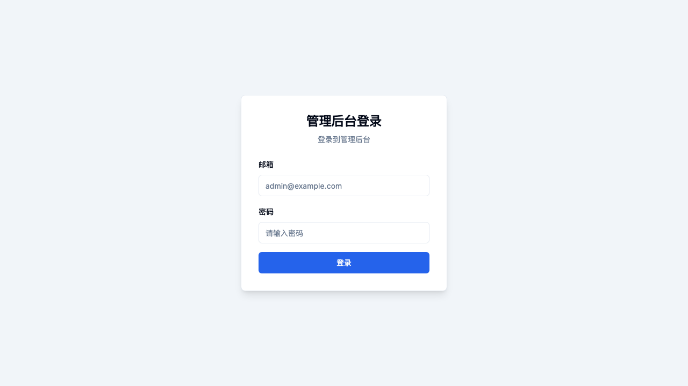

输入管理员账号和密码后，点击“登录”。

#### 登录后查看仪表盘

登录成功后会进入后台首页。这里是日常进入系统后的第一个页面，适合先确认当前系统运行状态，再进入具体模块。

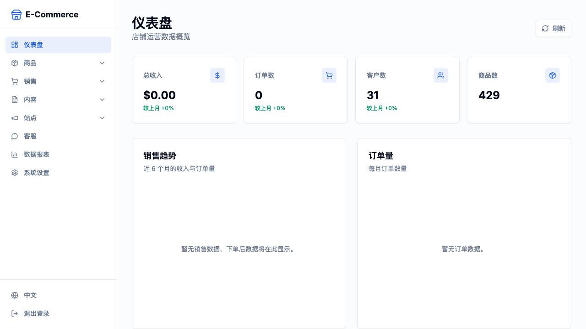

左侧导航是最常用的工作入口，日常会重点用到这些区域：
- 商品：商品、分类、品牌、标签等
- 销售：订单、客户、促销等
- 内容：Banner、文章、媒体资源等
- 站点：菜单、公告等
- 设置：系统设置、翻译等

### 1.2 核心流程演示

这一节用最常见的 3 条维护链路，帮助运营人员先建立整体感觉：后台改什么，前台哪里会跟着变化。

#### 1.2.1 查看商品

先进入“商品管理”，确认商品列表的基本结构。

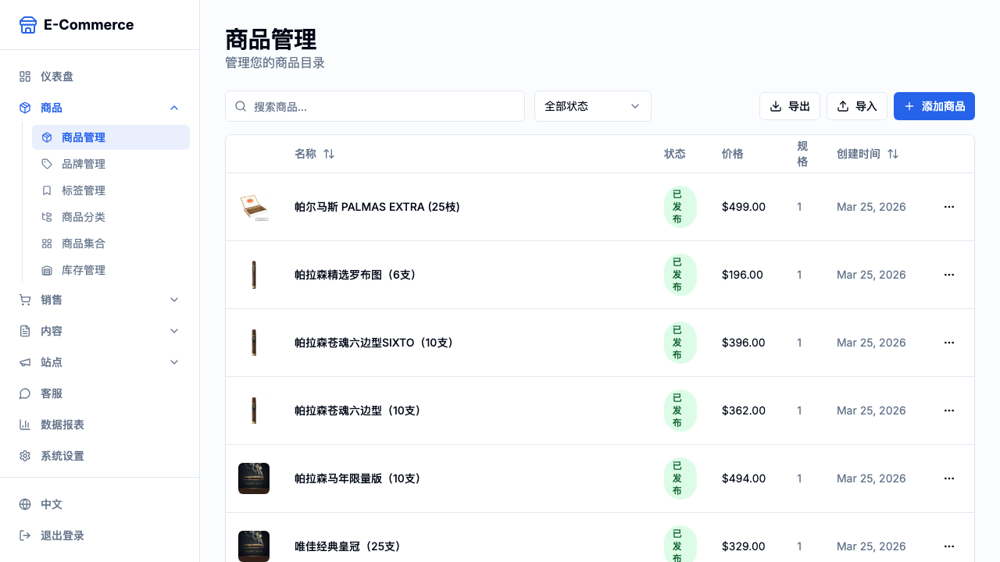

列表页通常会看到这些信息：
- 商品名称
- 价格
- 上架状态
- 创建时间
- 进入编辑页的操作入口

进入某个商品后，可以查看商品的主要填写区域。

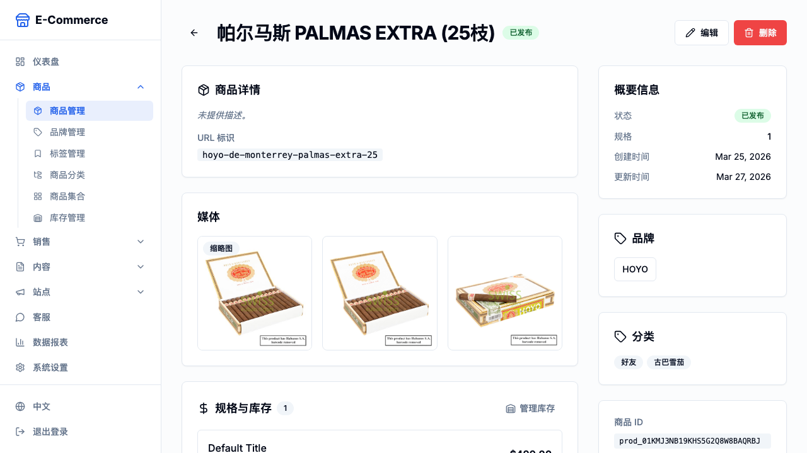

商品编辑页重点维护的内容包括：
- 商品名称和副标题
- 商品说明
- 商品图片
- 规格、价格和库存
- 品牌、分类、标签
- 搜索展示信息

#### 1.2.2 查看首页 Banner

Banner 管理用于维护首页轮播图和活动入口。

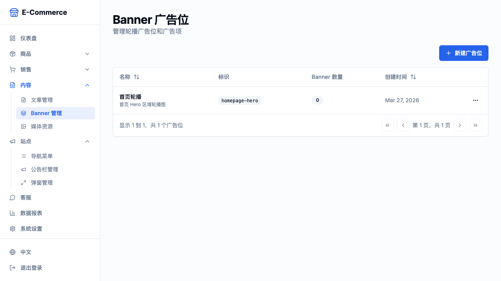

进入首页轮播的详情页后，可以继续查看每一张轮播图的配置。

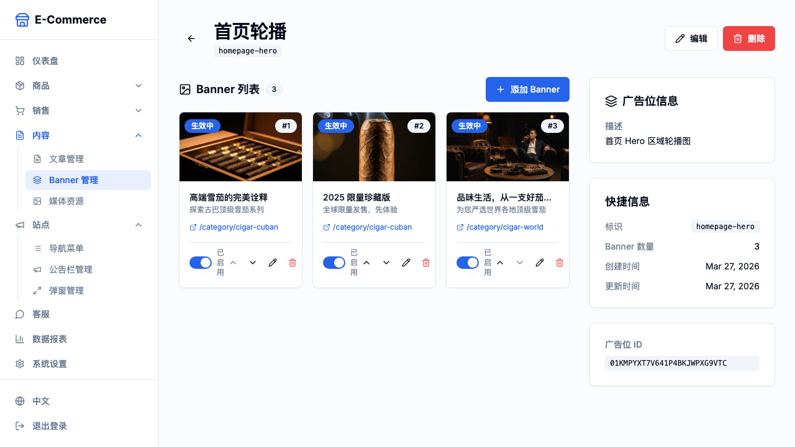

Banner 日常重点维护的是：
- 图片
- 标题和副标题
- 按钮文案
- 跳转链接
- 启用状态
- 排序

#### 1.2.3 查看导航菜单

菜单管理决定前台顶部导航和页脚链接显示什么、怎么跳转。

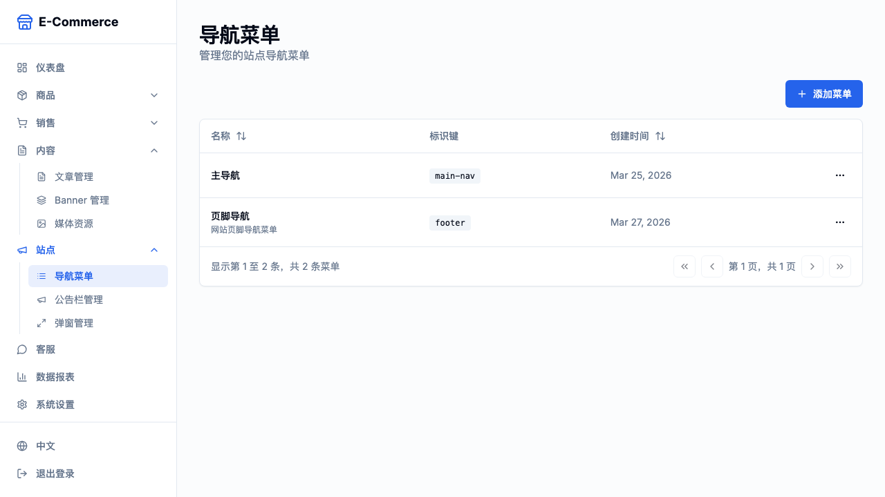

进入某一套菜单后，可以查看菜单项的名称、层级和跳转设置。

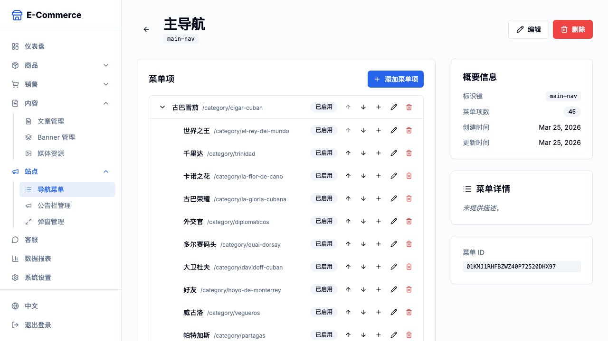

菜单维护最常见的是：
- 改菜单名称
- 调整上下级关系
- 修改跳转地址
- 决定某个菜单是否显示

#### 1.2.4 回到前台核对效果

完成后台维护后，建议立即回到前台检查实际展示，而不是只看后台页面。

**首页**

首页可以集中看到：
- 顶部导航
- 首页轮播
- 商品合集区块
- 文章推荐区块
- 页脚链接

**商品展示区**

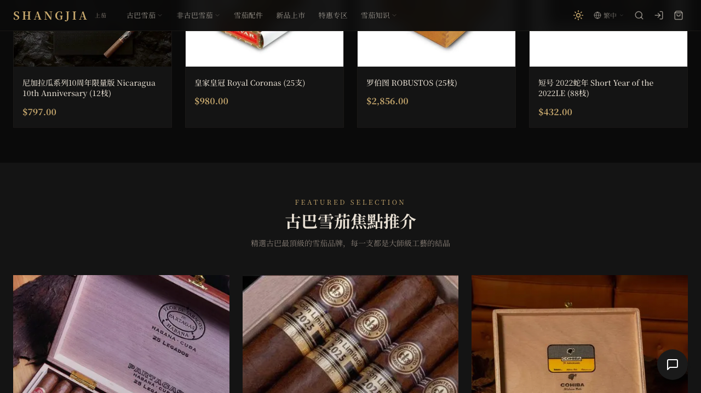

商品区会展示商品图片、名称、价格和进入详情页的入口。

**商品详情页**

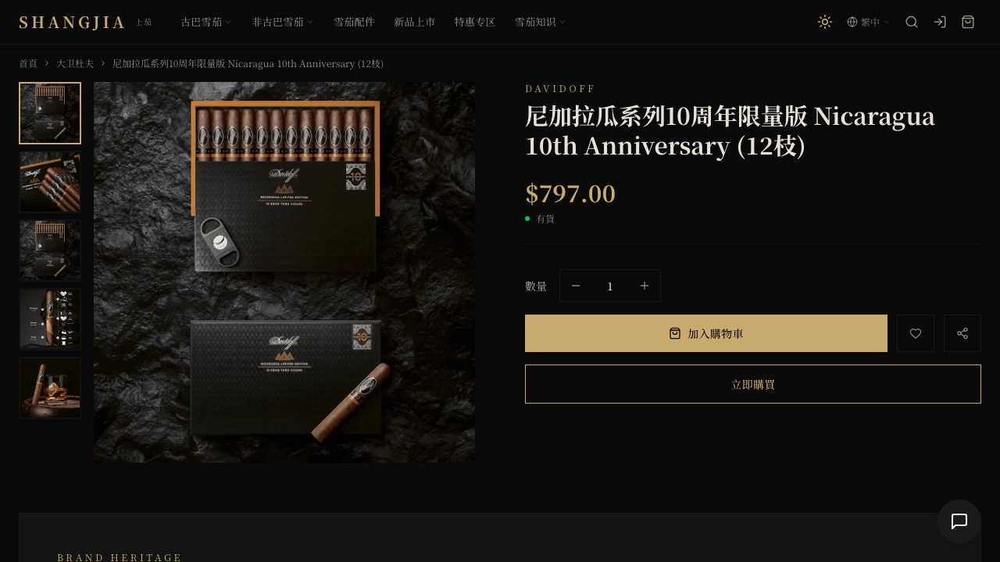

商品详情页会展示商品主图、品牌、价格、规格、商品说明和相关推荐。

**购物车入口**

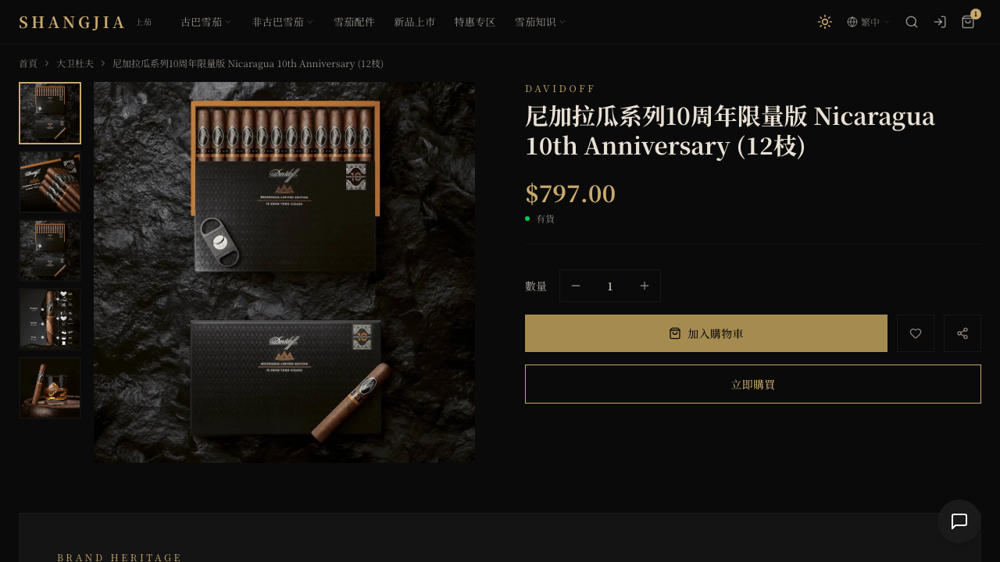

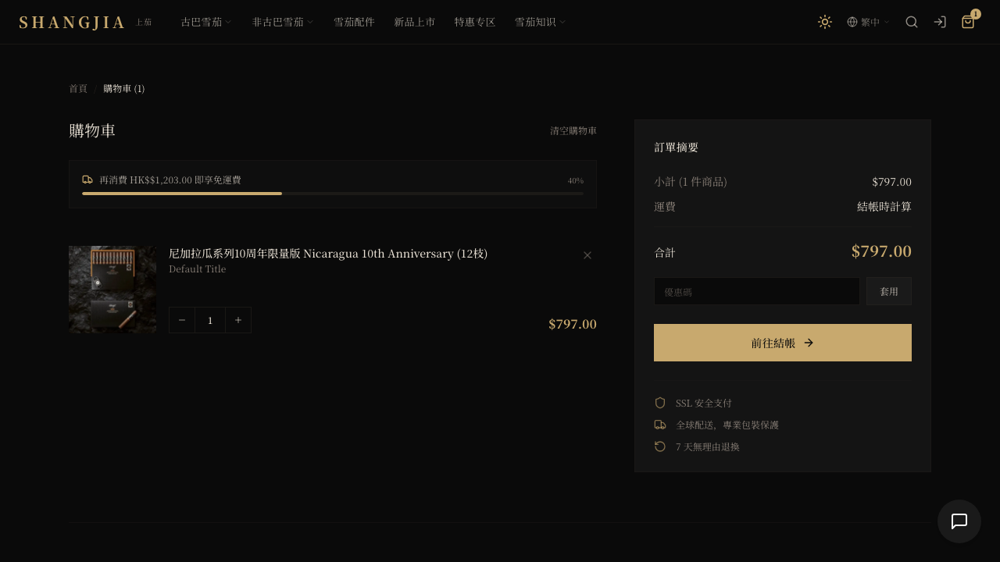

如果商品可加入购物车，用户会先看到加入成功提示，再进入购物车页查看已选商品和金额汇总。

### 1.3 后台内容如何在前台生效

从运营视角看，最重要的不是系统原理，而是记住“改哪里，会影响哪里”。

| 后台模块 | 主要维护内容 | 前台常见查看位置 |
|---------|-------------|----------------|
| 商品管理 | 商品名称、图片、规格、价格、库存、品牌、分类 | 商品列表页、商品详情页、搜索结果 |
| Banner 管理 | 首页轮播图、活动标题、跳转按钮 | 首页首屏轮播 |
| 菜单管理 | 顶部导航、下拉大菜单、页脚链接 | 顶部导航、页脚 |
| 商品合集管理 | 首页精选商品区块和顺序 | 首页商品区块 |
| 文章管理 | 文章标题、摘要、正文、封面图 | 文章列表页、文章详情页 |
| 品牌管理 | 品牌名称、品牌说明、Logo | 商品详情页中的品牌说明区 |
| 翻译 | 商品、文章、Banner、菜单等多语言内容 | 切换语言后的前台页面 |

建议养成这条固定检查顺序：

1. 先在后台找到正确模块。
2. 完成修改并保存。
3. 立即刷新前台对应页面。
4. 再点一次链接或按钮，确认用户实际会看到的结果。

---

## 第二章：商品管理

### 2.1 模块概述

商品管理是后台最核心的模块之一，用来维护商城里每一款商品的展示内容和售卖信息。

通过这个模块，运营人员可以完成：
- 维护商品名称、副标题和商品说明
- 上传商品封面图和详情图
- 设置规格、价格和库存
- 关联品牌、分类和标签
- 调整搜索展示信息
- 决定商品是否在前台显示

它会直接影响这些前台位置：
- 首页商品区块
- 分类页商品列表
- 搜索结果页
- 商品详情页
- 购物车和结账页中的商品信息

### 2.2 界面导览

#### 商品列表页

进入路径：`商品` → `商品管理`

列表页最常用的区域包括：
- 搜索框：按商品名称查找商品
- 状态筛选：快速筛选已发布或未发布商品
- 商品列表：查看商品名称、价格、状态和创建时间
- 新建按钮：进入新建商品页

#### 商品编辑页

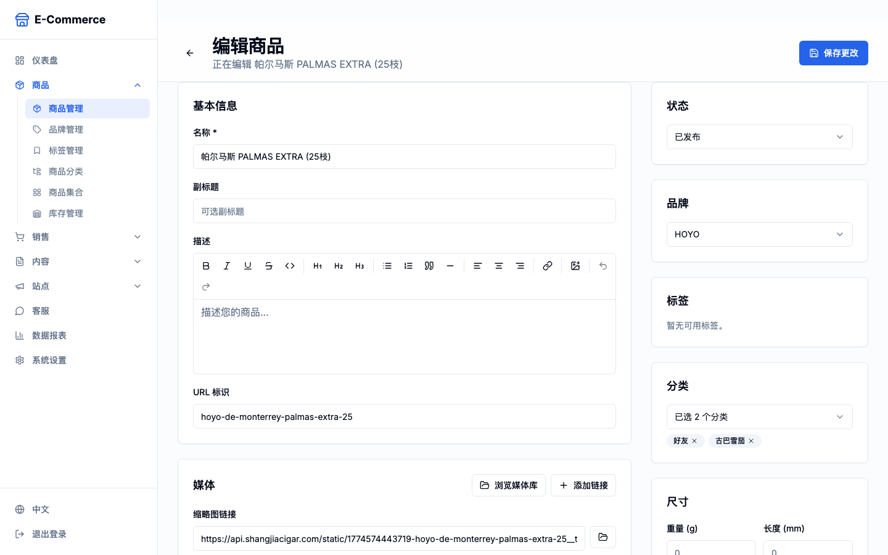

编辑页通常可以分成 5 个重点区域：

1. **基础信息**
   - 商品名称
   - 副标题
   - 商品说明
   - 链接地址

2. **图片区**

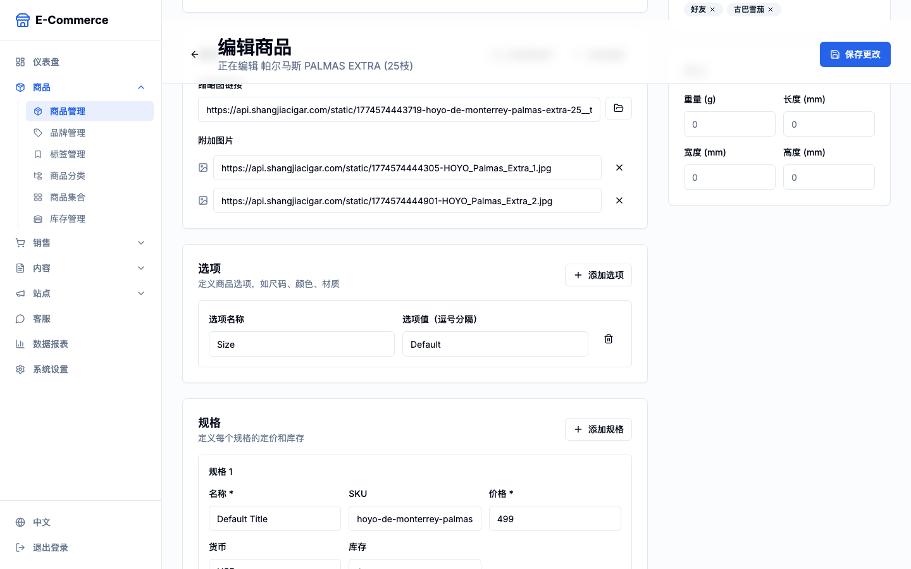

这里决定前台商品卡片和商品详情页会展示哪些图片。

3. **规格、价格和库存区**

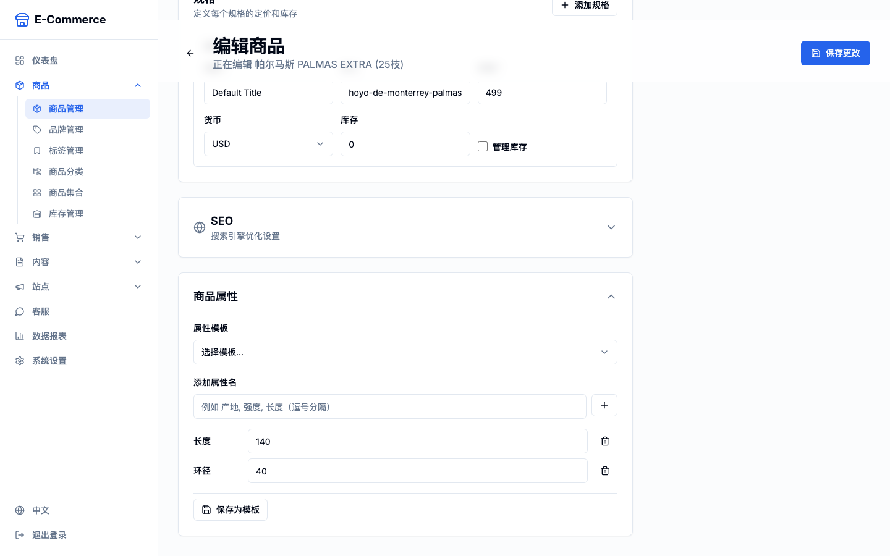

这里用于维护商品规格、商品编码、价格和库存数量。

4. **品牌、分类和标签区**

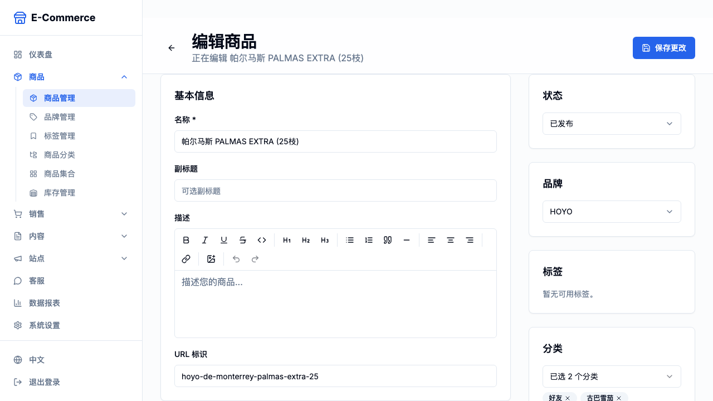

这里决定商品会归到哪个品牌、哪个分类，以及是否带上特定标签。

5. **选择器和媒体库**

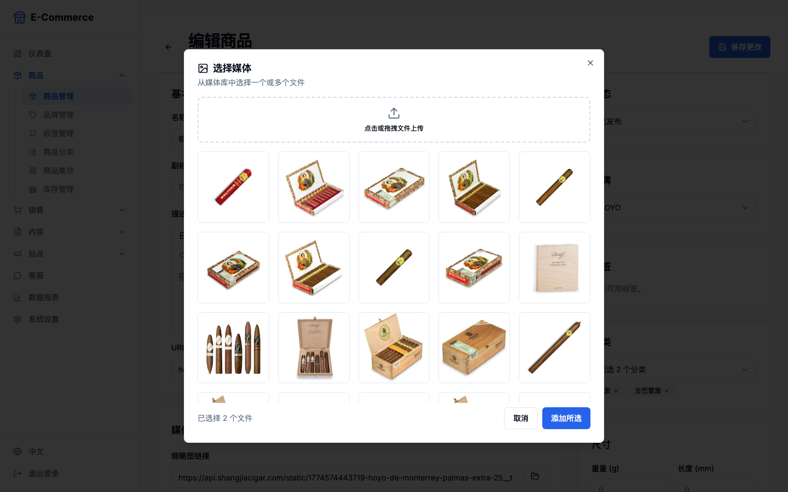

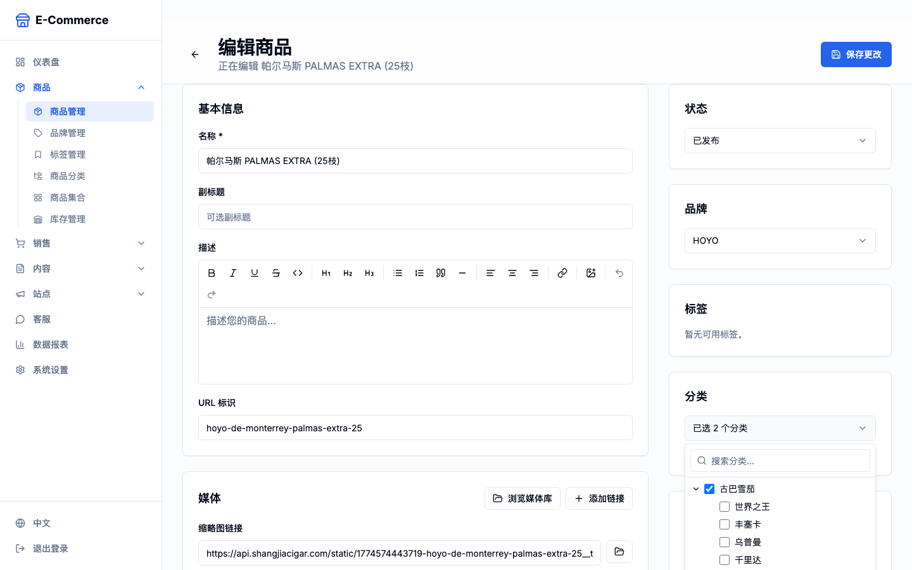

如果需要从系统里选图片、选分类或选其它关联内容，通常会打开类似的选择器页面。

### 2.3 操作步骤

#### 第一步：填写商品基础信息

1. 点击“新建商品”或进入已有商品的编辑页。
2. 先填写商品名称，让用户一眼就知道这是什么商品。
3. 再填写副标题，用来补充卖点、系列或包装说明。
4. 在商品说明里写清楚商品特点、适合人群、购买建议等信息。
5. 检查链接地址是否清晰、稳定。这个地址会影响商品详情页网址，发布后不建议频繁修改。

#### 第二步：上传封面图和详情图

1. 先设置封面图。封面图会直接出现在商品列表页和首页商品卡片里。
2. 再补充详情图。详情图会出现在商品详情页，适合展示多个角度或包装细节。
3. 如果打开了媒体库选择器，优先选择主题明确、清晰度高的图片。
4. 图片顺序也要检查，因为前台通常会按后台顺序展示。

#### 第三步：设置规格、价格和库存

1. 如果商品只有一个规格，直接填写默认规格的价格和库存即可。
2. 如果商品有多个包装或多个规格，先建立规格项，再分别填写价格和库存。
3. 商品编码用于后台识别不同规格，建议命名统一、便于查找。
4. 保存前要确认每个规格都已经填好价格和库存，避免前台可见但无法正常下单。

#### 第四步：关联品牌、分类和标签

1. 选择品牌，商品详情页会显示对应的品牌说明区。
2. 选择分类，商品会出现在对应分类页中。
3. 按需要添加标签，例如“新品”“限量版”等，方便前台强调卖点。
4. 如果商品需要在多个分类中被找到，可以按页面支持的方式选择多个分类。

#### 第五步：补充搜索展示信息

编辑页中通常会有“搜索展示信息”区域。这里主要影响：
- 搜索结果页标题
- 搜索结果摘要
- 分享出去时看到的图片和说明

如果是重点商品、活动商品或新品，建议单独检查这一块，不要完全依赖系统自动带出。

#### 第六步：保存后回前台检查

保存后，至少检查 3 个页面：
- 分类页：确认商品是否出现在正确分类中
- 商品详情页：确认名称、图片、价格和品牌是否正常
- 首页或商品区块：确认需要曝光的商品是否在正确位置展示

### 2.4 后台到前台的对应关系

#### 分类页示例

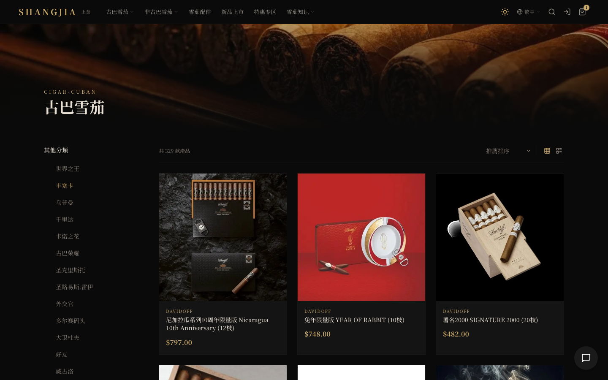

#### 商品列表示例

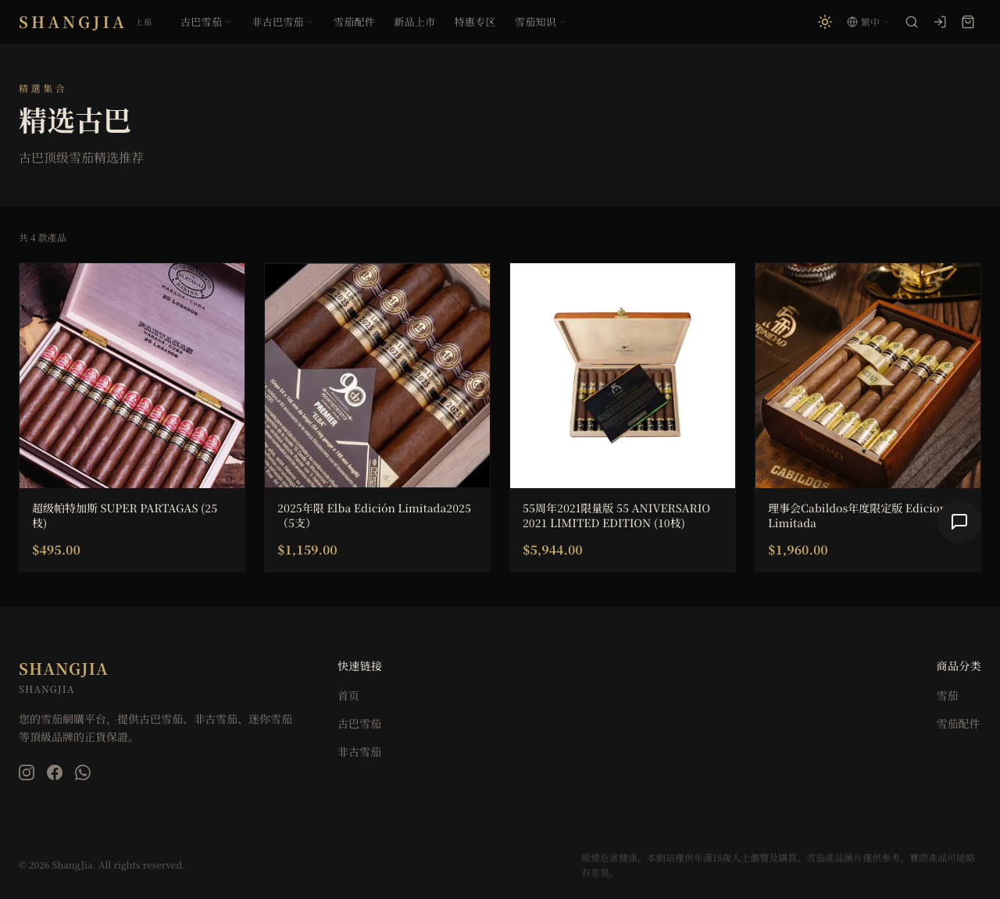

#### 商品详情页示例

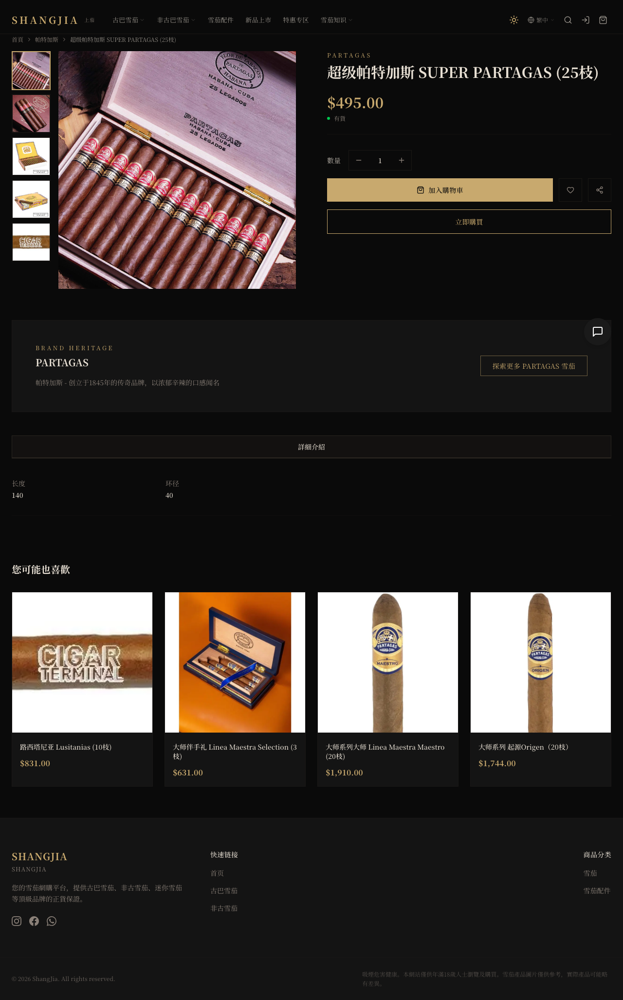

| 后台维护内容 | 前台主要展示位置 |
|-------------|----------------|
| 商品名称 | 商品卡片标题、商品详情页标题 |
| 副标题 | 商品卡片补充说明、商品详情页副标题 |
| 商品说明 | 商品详情页正文说明区域 |
| 封面图 | 首页商品卡片、分类页商品卡片、搜索结果页 |
| 详情图 | 商品详情页图片区域 |
| 规格 | 商品详情页规格选择区域 |
| 价格 | 商品卡片价格、商品详情页价格、购物车价格 |
| 库存 | 商品详情页库存状态、是否可购买 |
| 品牌 | 商品详情页品牌说明区 |
| 分类 | 分类页商品列表、面包屑等分类入口 |
| 标签 | 商品卡片标签、商品详情页标签区域 |
| 搜索展示信息 | 搜索结果标题、摘要和分享卡片 |

日常核对时可以用这条顺序：

`后台商品编辑页` → `前台分类页` → `前台商品详情页`

这样最容易快速发现是“没保存”“放错分类”还是“前台展示没更新”。

### 2.5 常见问题

#### 1. 修改商品后，前台多久会看到变化？

通常保存后刷新前台页面就能看到变化。建议不要只刷新一个页面，分类页和详情页都检查一次。

#### 2. 为什么分类页里看不到刚编辑的商品？

先检查商品是否已经选择正确分类，再检查当前状态是否允许前台显示。

#### 3. 封面图和详情图有什么区别？

- 封面图主要用于列表页和首页商品卡片
- 详情图主要用于商品详情页

两者都重要，不能只传其中一类。

#### 4. 商品有多个包装，应该怎么做？

先在规格区域把不同包装建出来，再分别填写每个规格的价格、库存和商品编码。

#### 5. 为什么品牌已经建好了，商品详情页却没有品牌说明？

品牌本身建好还不够，还要在商品编辑页里把该商品关联到正确品牌。

#### 6. 标签建好了，为什么前台没变化？

标签只创建不关联商品时，前台不会变化。还需要到商品编辑页里把标签挂到具体商品上。

#### 7. 链接地址可以改吗？

可以，但不建议频繁改。因为它会影响商品详情页网址，也会影响外部已经分享出去的链接。

#### 8. 保存后应该优先检查哪些页面？

至少检查分类页、商品详情页，以及首页中可能展示该商品的区块。

---

## 第三章：菜单管理

### 3.1 模块概述

菜单管理决定商城前台哪些导航入口会显示给用户，以及这些入口点进去会到哪一页。对运营来说，最重要的是先分清自己改的是顶部导航、顶部下拉大菜单，还是页脚菜单。

| 后台菜单 | 前台显示位置 | 适合放什么 | 改完会影响什么 |
|---------|------------|-----------|--------------|
| 主导航 | 前台页面顶部第一排导航 | 一级栏目入口 | 影响全站顶部导航的名称、顺序和跳转 |
| 主导航下的子菜单项 | 鼠标移到顶部栏目后展开的大菜单 | 品牌、子分类、专题入口 | 影响对应栏目展开后的下拉内容 |
| 页脚导航 | 前台页面最底部页脚区 | 快速链接、分类汇总、帮助入口 | 影响全站页脚链接分组和跳转 |

当前后台列表里主要有两套菜单：
- `main-nav`：主导航，也就是前台页面顶部那一排主入口
- `footer`：页脚菜单，也就是前台最底部的页脚链接区

这两个系统标识决定菜单显示在哪一块前台区域。日常维护标题、链接和层级时，通常不要改这两个标识本身。

### 3.2 界面导览

#### 菜单列表页

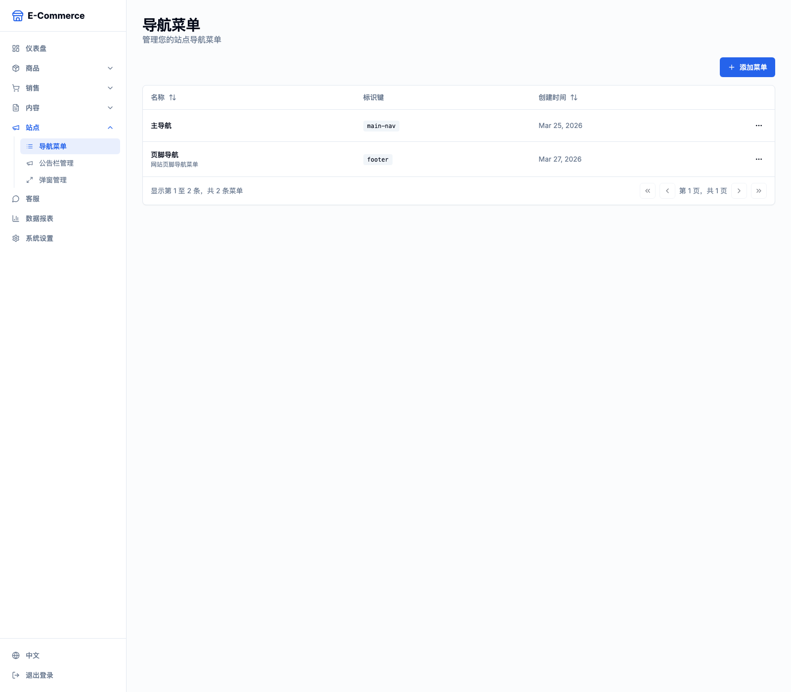

进入前先确认目标区域：
- 要改前台顶部第一排入口，就进“主导航”
- 要改前台底部链接区，就进“页脚导航”

#### 主导航编辑页

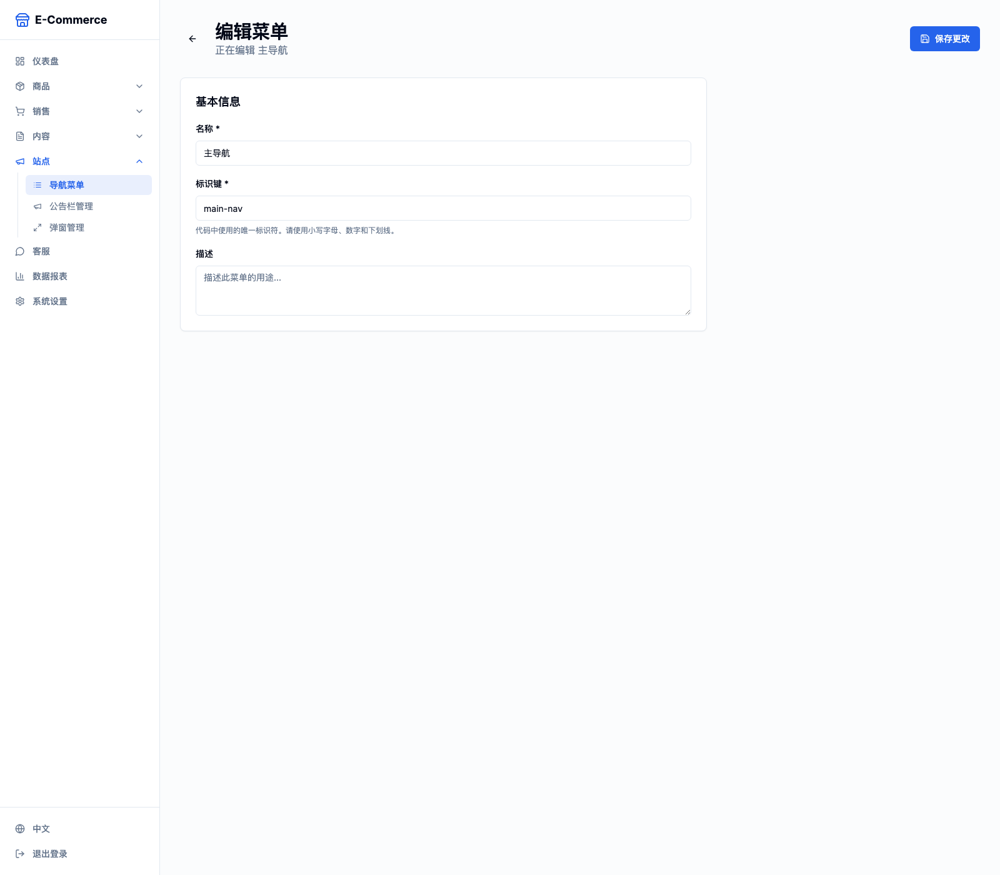

这里主要用来确认当前进入的是哪一套菜单：
- 名称：后台里这套菜单的叫法
- 系统标识：决定它是主导航还是页脚菜单
- 描述：后台备注，不直接显示给用户

#### 菜单项编辑表单

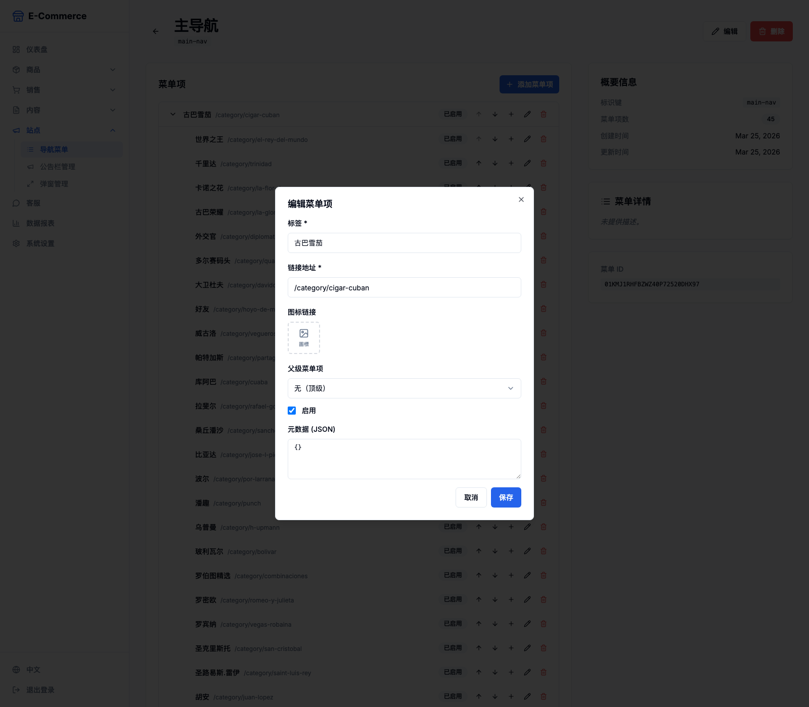

菜单项表单里最关键的是这 4 项：
- 标签：用户在前台会看到的文字
- 链接地址：用户点击后进入的页面
- 父级菜单项：决定它在第一层，还是挂在某个栏目下面
- 启用：决定这条菜单是否显示

图标和附加设置也会出现在页面里，但日常维护文字、链接和层级时，优先关注上面 4 项即可。

#### 页脚菜单页

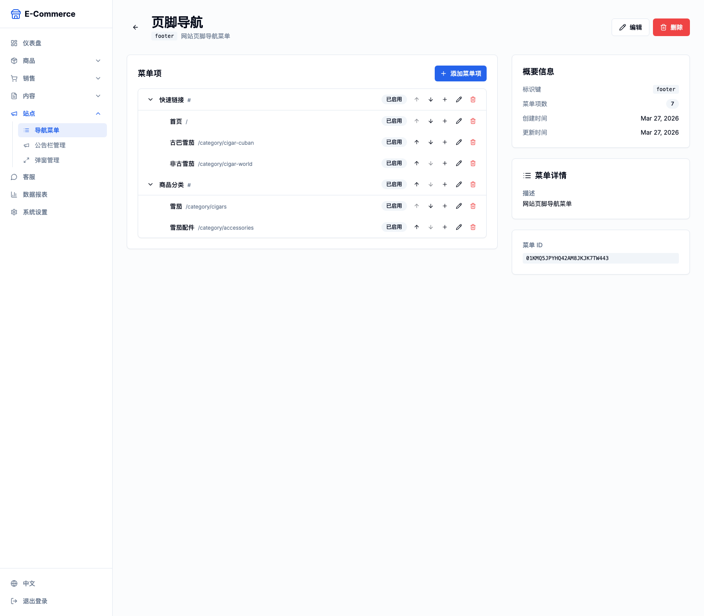

页脚菜单通常按“分组标题 + 子链接”的方式整理。例如“快速链接”“商品分类”是分组标题，下面再挂具体可点击的页面入口。

### 3.3 操作步骤

#### 第一步：先判断要改的是顶部、下拉，还是页脚

先用前台位置反推后台菜单：
- 前台顶部第一排看到的栏目，对应后台“主导航”里的顶级菜单项
- 鼠标移到顶部栏目后展开的一大片下拉链接，对应后台“主导航”里挂在该栏目下面的子菜单项
- 页面最底部的“快速链接”“商品分类”等栏目，对应后台“页脚导航”

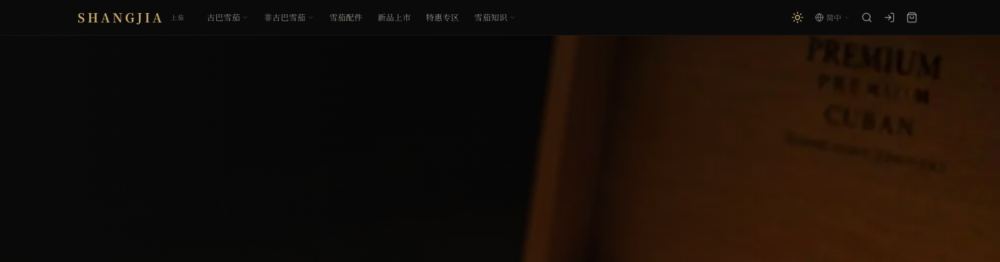

#### 第二步：进入对应菜单，确认层级

进入“主导航”或“页脚导航”后，先看这条菜单项有没有父级：
1. 如果父级是“无（顶级）”，它通常会直接显示在当前菜单区域的第一层
2. 如果它挂在某个上级下面，在主导航里会显示为下拉大菜单内容，在页脚里会显示为某个分组下面的子链接

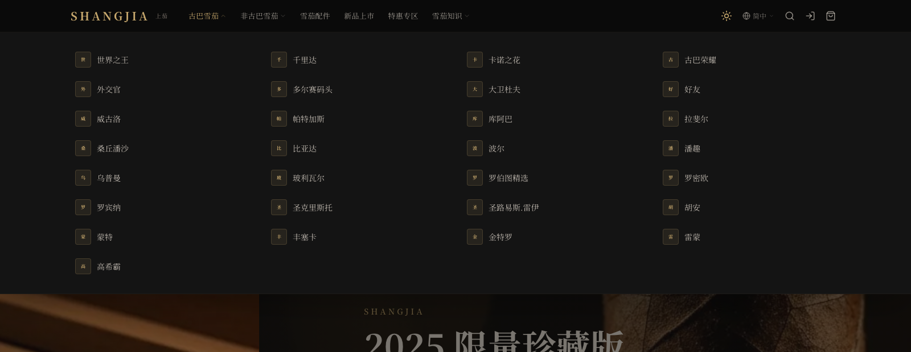

也就是说：
- 顶级项负责决定顶部先出现哪个栏目
- 子项负责决定栏目展开后给用户哪些细分入口

#### 第三步：打开菜单项表单，重点核对四件事

打开某条菜单项后，按下面顺序核对最稳妥：
1. 看标签是不是前台要显示的文字
2. 看链接地址是不是用户真正要去的页面
3. 看父级菜单项是不是放在正确层级
4. 看启用是否打开

如果只是日常维护文案和跳转，通常优先改这四项，其它附加项先保持现状。

#### 第四步：区分页脚里的“分组标题”和“可点击链接”

页脚菜单和顶部导航最大的区别，是它常常先有一个分组标题，再在下面放具体链接。
- 分组标题负责告诉用户这一列是什么内容
- 子链接负责真正跳转

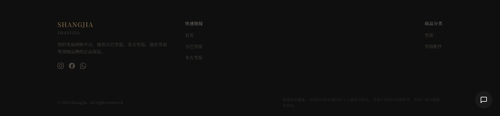

### 3.4 后台到前台的对应关系

| 后台改动位置 | 改动内容 | 前台显示位置 | 实际影响 |
|------------|---------|------------|---------|
| 主导航中的顶级菜单项 | 标签、顺序、启用状态 | 页面顶部第一排栏目 | 影响用户第一眼看到的主入口 |
| 主导航中的子菜单项 | 标签、顺序、启用状态 | 顶部栏目展开后的大菜单 | 影响用户继续向下选择时看到的入口 |
| 菜单项的链接地址 | 点击后跳转页面 | 对应菜单文字背后的落地页 | 影响用户点击后去到哪里 |
| 菜单项的父级菜单项 | 菜单层级归属 | 顶级栏位、下拉区、页脚分组 | 决定它显示在第一层还是某个栏目下面 |
| 页脚导航中的顶级菜单项 | 分组标题名称 | 页脚列标题 | 影响页脚一整列的栏目名 |
| 页脚导航中的子菜单项 | 具体链接名称和顺序 | 页脚列下方链接 | 影响页脚某一条可点击入口 |
| 菜单项的启用状态 | 显示或隐藏 | 顶部导航、大菜单、页脚 | 关闭后该入口不会在前台出现 |

最实用的判断方法不是记术语，而是记前台位置：
- 想改顶部第一排，就回到“主导航”找顶级项
- 想改展开后的大菜单，就在“主导航”里找对应父级下面的子项
- 想改最底部的链接区，就去“页脚导航”

### 3.5 常见问题

**1. 我改了菜单项，为什么它跑到下拉大菜单里了？**

先看父级菜单项。如果它不是顶级项，而是挂在某个主导航栏目下面，前台就会把它显示在该栏目的下拉区里。

**2. 我明明改了菜单，为什么前台顶部没有变化？**

最常见的原因有三种：
- 改到页脚导航了
- 菜单项没有启用
- 改的是某个栏目下面的子项，所以它只会出现在展开后的大菜单里

**3. 页脚里的分组标题为什么点了没反应？**

页脚里有些顶级项本身只是分组标题，用来把一列链接归类；真正可点击的通常是它下面的子链接。

**4. `main-nav` 和 `footer` 可以改吗？**

不建议。它们决定整套菜单出现在哪个前台区域，日常维护菜单内容时，通常只改菜单项，不改这两个系统标识。

---

## 第四章：Banner 管理

### 4.1 模块概述

Banner 管理用于维护商城前台的广告位和每个广告位里的轮播内容。可以把“广告位”理解成展示位置，把“轮播内容”理解成这块位置里的一张张轮播图。

当前最重要的广告位是 `homepage-hero`，也就是首页首屏轮播。运营日常维护 Banner 时，重点要看三件事：
- 广告位是不是维护在正确位置
- 每张轮播内容的图片、标题、副标题、按钮文案、跳转链接是否准确
- 轮播顺序和启用状态是否与前台首页展示一致

这个模块会直接影响前台首页首屏的以下内容：
- 轮播大图
- 标题和副标题
- 按钮文案
- 按钮点击后的去向
- 多张轮播内容的先后顺序

### 4.2 界面导览

#### Banner 广告位列表

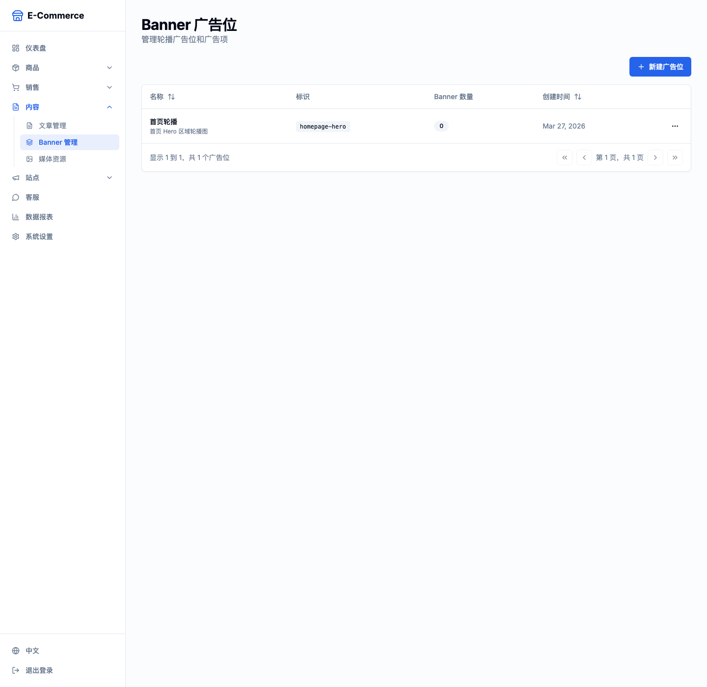

列表页按“广告位”展示内容。当前可见的 `homepage-hero` 是首页首屏轮播，用来定位“这是首页最上方那组轮播图”。

#### 首页轮播详情页

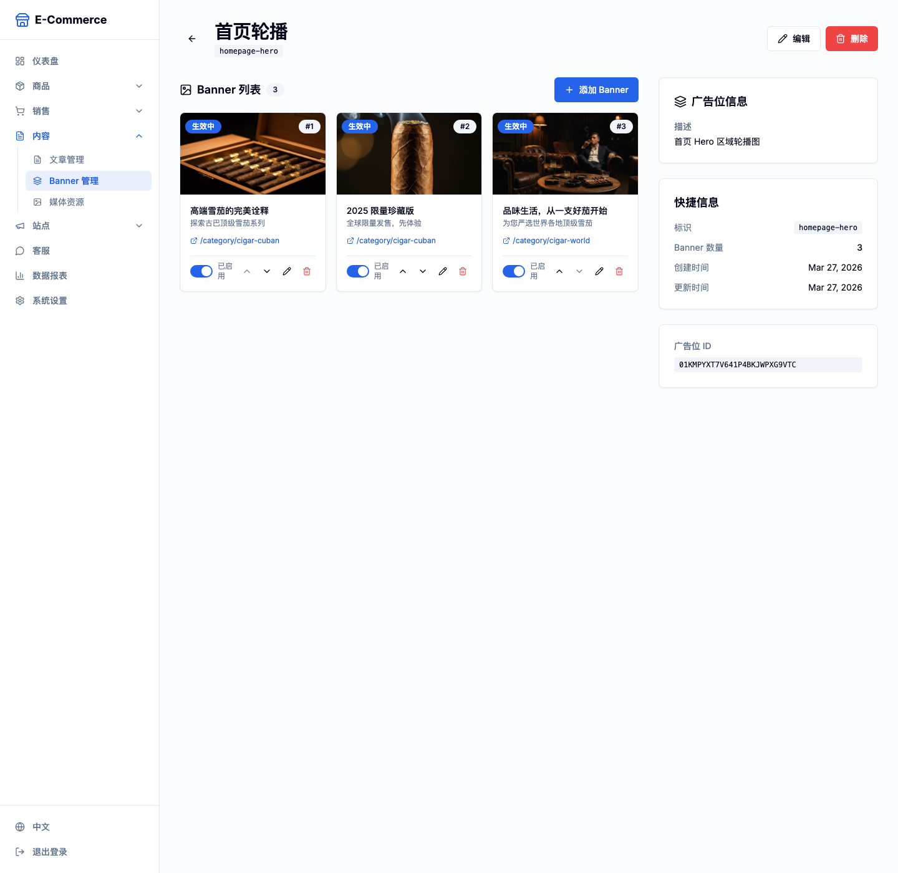

进入“首页轮播”后，会看到这个广告位下的全部轮播内容卡片。每张卡片代表首页轮播中的一张图，卡片上会直接显示缩略图、标题、副标题、跳转链接、启用状态和当前顺序。

#### 轮播内容编辑表单

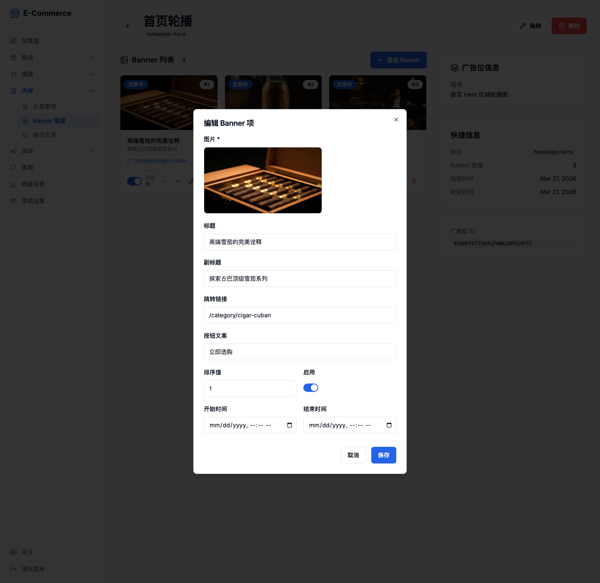

点击轮播内容卡片上的编辑按钮后，会打开编辑表单。这里可以维护：
- 图片
- 标题
- 副标题
- 跳转链接
- 按钮文案
- 排序值
- 启用状态
- 开始时间和结束时间

#### 前台首页轮播效果

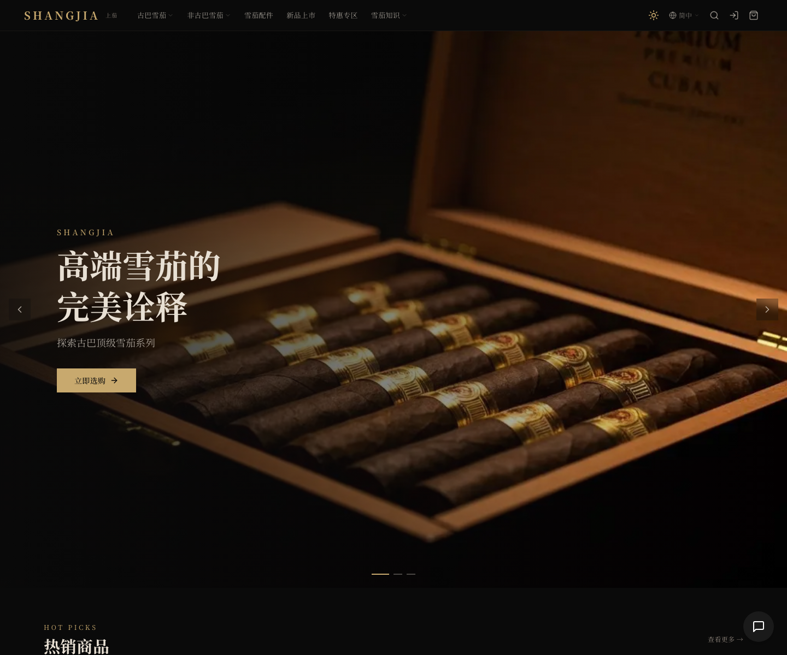

前台首页首屏会直接展示“首页轮播”广告位里的内容。运营改动图片、文案、链接和顺序后，最终都要回到首页首屏核对效果。

### 4.3 操作步骤

#### 查看 Banner 广告位

1. 进入后台左侧导航 `内容` → `Banner 管理`
2. 在列表中找到需要维护的广告位
3. 当前首页首屏轮播对应的系统标识是 `homepage-hero`
4. 点击广告位名称进入详情页

#### 查看轮播内容配置

1. 在详情页先确认当前广告位下有几张轮播内容卡片
2. 每张卡片就是前台首页轮播中的一张图
3. 需要修改哪一张，就进入对应编辑表单
4. 重点检查并维护：
   - 图片
   - 标题
   - 副标题
   - 跳转链接
   - 按钮文案
   - 启用状态

#### 查看启用状态与排序

1. 每张轮播内容卡片都会显示当前顺序
2. 如果希望某张内容更早出现，可调整顺序
3. 如果某张内容暂时不想展示，可先关闭启用
4. 保存后不要只看后台，还要回首页确认实际轮播顺序和按钮跳转

### 4.4 后台到前台的对应关系

| 后台维护项 | 运营关注点 | 前台会发生什么变化 |
|---------|-----------|------------------|
| 广告位名称 / 标识 | 确认是否在正确位置维护 | 决定这次修改落在哪个页面区块 |
| 图片 | 是否为本次活动要展示的主视觉 | 首页首屏轮播大图会变化 |
| 标题 | 是否突出本次主推内容 | 首页首屏主标题会变化 |
| 副标题 | 是否把卖点说明清楚 | 首页首屏标题下方说明会变化 |
| 按钮文案 | 是否明确引导用户点击 | 首页首屏按钮文字会变化 |
| 跳转链接 | 是否指向正确页面 | 用户点击按钮后的去向会变化 |
| 启用状态 | 该条内容是否需要继续展示 | 未启用的内容不会出现在首页轮播中 |
| 顺序 | 哪一张先出现、哪一张后出现 | 首页轮播的播放顺序会变化 |

建议按下面顺序核对：

1. 先确认广告位
2. 再确认轮播内容
3. 保存后刷新首页
4. 最后点一次前台按钮，确认去向正确

### 4.5 常见问题

**1. 我已经改了 Banner，为什么首页没有变化？**

先确认修改的是不是 `homepage-hero` 这个广告位；再确认这条轮播内容是否仍然处于启用状态；保存后刷新前台首页重新查看。

**2. 为什么按钮文案改对了，但点进去不是我要的页面？**

按钮文案只影响按钮上显示的文字，真正决定去向的是跳转链接字段。

**3. 为什么我以为已经排到第一张了，前台顺序还是不对？**

后台顺序调整后，仍要以前台首页首屏实际展示顺序为准，保存后必须回前台再核对一次。

---

## 第五章：商品合集管理

### 5.1 模块概述

商品合集用于把多款商品整理成首页的固定展示区块。运营日常在这里主要处理三件事：先确认“后台这个合集对应首页哪个区块”，再整理区块里的商品顺序，最后回到前台核对用户实际看到的效果。

| 后台合集名称 | 后台标识 | 首页对应区块 | 用户当前看到的效果 |
|------------|---------|------------|------------------|
| 热门精选 | `hot-picks` | 首页上部的 `HOT PICKS / 热销商品` 区块 | 当前直接展示 4 张热门商品卡片 |
| 精选古巴 | `featured-cuban` | 首页中部的 `FEATURED SELECTION / 古巴雪茄焦点推介` 区块 | 当前先展示 3 张精选商品卡片，并提供“浏览全部商品”入口 |
| 限量版 | `limited-editions` | 首页下方的 `LIMITED EDITION / 限量版` 区块 | 当前先展示 2 张限量版商品卡片和区块说明 |

### 5.2 界面导览

#### 合集列表页

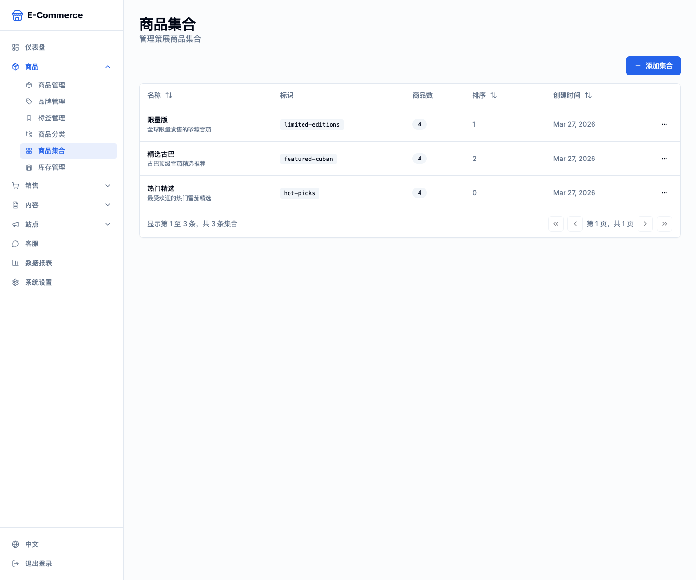

列表页一行代表一个首页区块。先看名称，再看系统标识，就能确认自己正在维护哪个区块。

#### 合集详情页

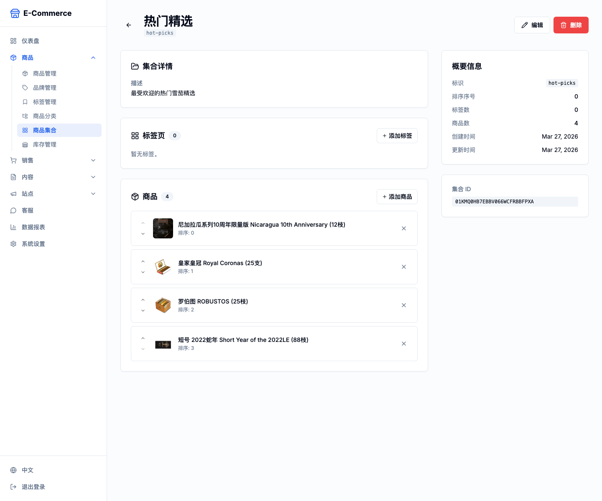

详情页上半部分是合集说明，下半部分是最常用的商品区域。商品从上到下的排列顺序，就是首页区块里商品卡片的主要展示顺序。

#### 商品选择器

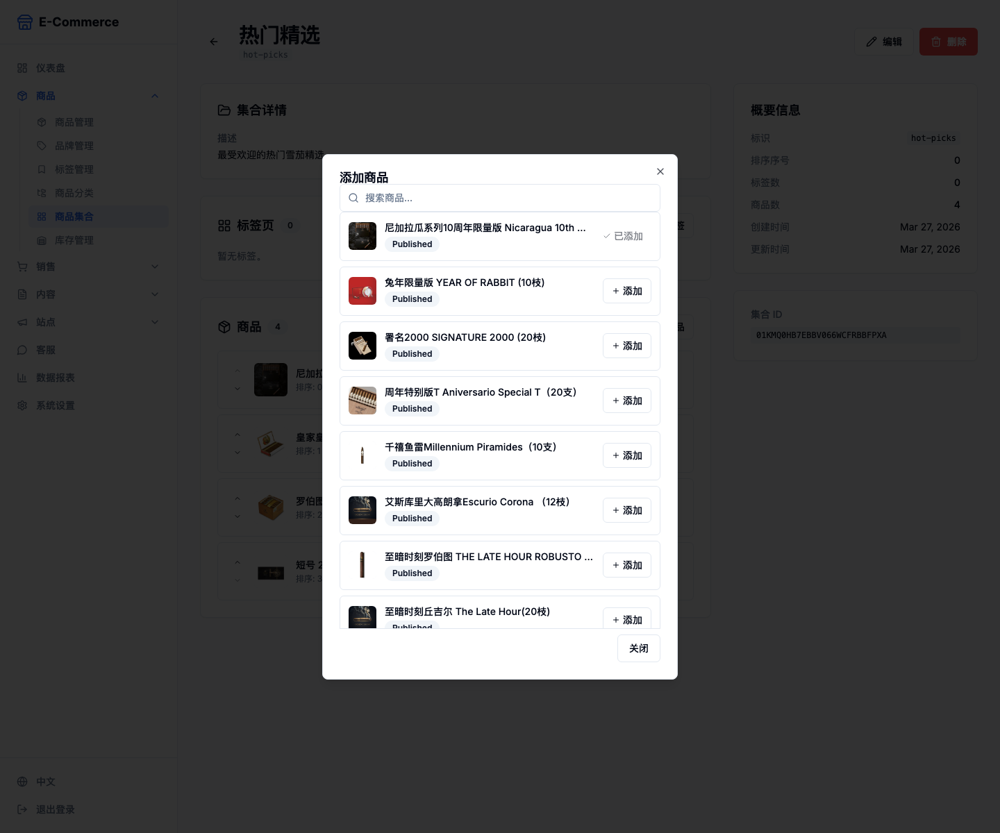

点击“添加商品”后，会打开商品选择器。这里的作用是挑选要放入区块的商品，不是修改商品本身的资料。

### 5.3 操作步骤

#### 先确认自己改的是哪个首页区块

1. 进入 `商品` → `商品集合`
2. 在列表页先看合集名称，再看标识
3. 按当前页面结构理解：
   - `hot-picks` 是“热门精选”
   - `featured-cuban` 是“精选古巴”
   - `limited-editions` 是“限量版”

#### 以“热门精选”为例整理区块内容

1. 打开 `hot-picks` 详情页
2. 查看当前商品顺序
3. 需要补充商品时，点击“添加商品”打开商品选择器
4. 需要调整前台展示先后时，在商品列表中整理顺序
5. 调整完成后，返回前台首页对应区块核对

#### 前台对照示例

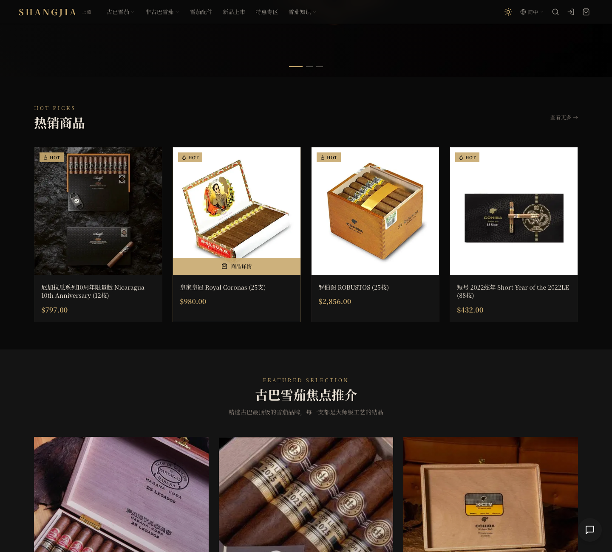

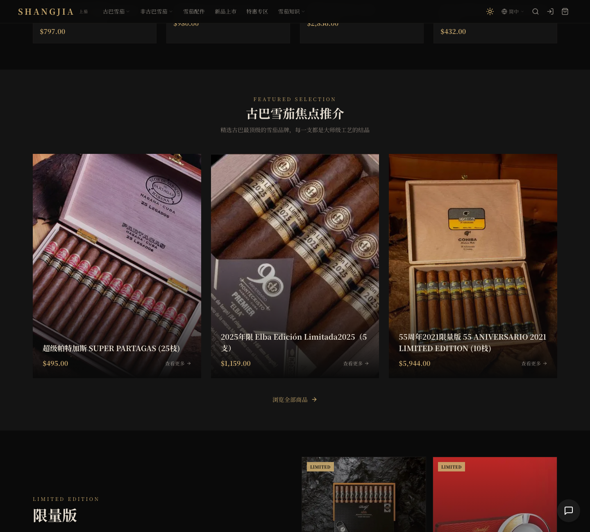

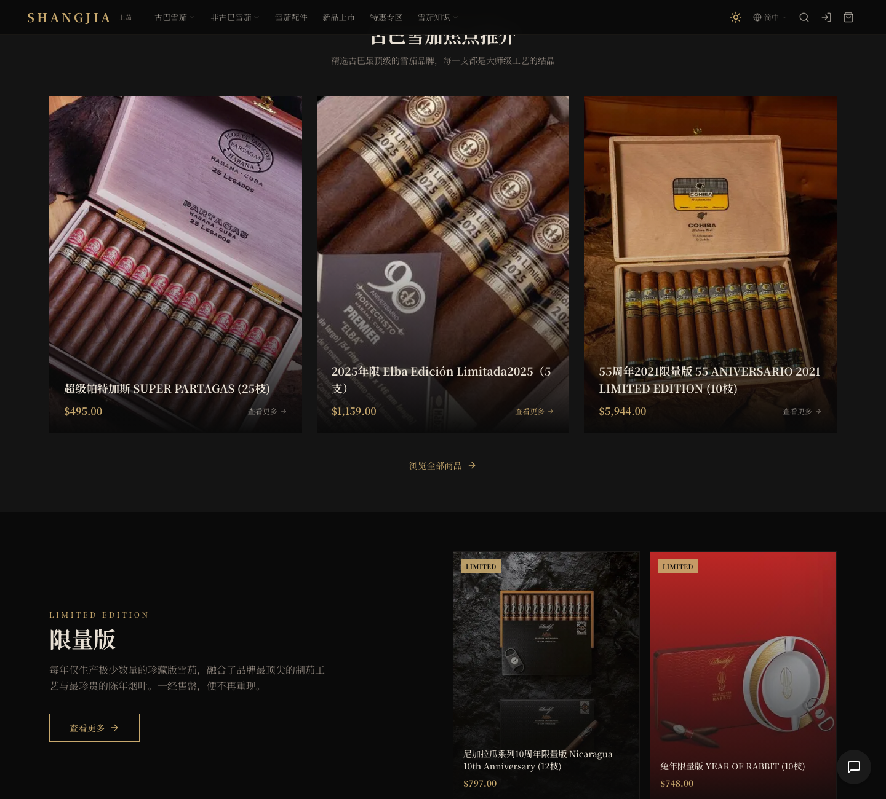

核对时重点看三件事：
- 区块有没有放对
- 商品顺序对不对
- 用户当前看到的商品数量是否符合区块样式

### 5.4 后台到前台的对应关系

| 运营查看或维护的位置 | 你在后台看到的内容 | 前台会发生什么变化 |
|------------------|----------------|------------------|
| 商品集合列表页 | 合集名称、标识、商品数 | 帮你确认这个合集对应首页哪一个区块 |
| 合集详情页的商品区域 | 商品列表及上下顺序 | 决定首页区块里商品卡片的展示先后 |
| 商品选择器 | 可以放入合集的商品范围 | 决定首页区块里最终有哪些商品可见 |
| 前台首页区块 | 区块标题、商品卡片、查看更多入口 | 用户最终看到的合集效果，以这里为准 |

可以简化理解为：

`先在后台选对合集` → `在合集里放对商品并整理顺序` → `回首页核对对应区块`

### 5.5 常见问题

**1. 后台写的是 `hot-picks`，前台为什么看到的是 `HOT PICKS / 热销商品`？**

这是同一个合集。系统标识只用于后台定位，前台显示的是面向用户的区块标题。

**2. 为什么我只调整了商品顺序，首页商品位置也跟着变了？**

因为合集详情页里的商品顺序，就是首页区块里商品卡片的展示顺序。

**3. 为什么后台合集里有 4 款商品，首页却没有一次全部显示？**

不同区块的首页样式不一样，有的会全部展示，有的会先展示前几款，再提供查看更多入口。

---

## 第六章：订单管理

### 6.1 模块概述

订单管理用于查看客户订单是否已经进入后台，并在列表页先判断订单当前处于什么处理阶段。

当前后台订单列表暂无真实订单数据，因此这一章先说明列表页当前可见的页面结构、搜索入口和筛选项，帮助运营人员知道“有没有订单”“该怎么查”“当前能看到哪些状态”。

### 6.2 界面导览

当前入口位于左侧菜单 `销售` → `订单管理`。页面上方是搜索与筛选区域，下方是订单列表区域。

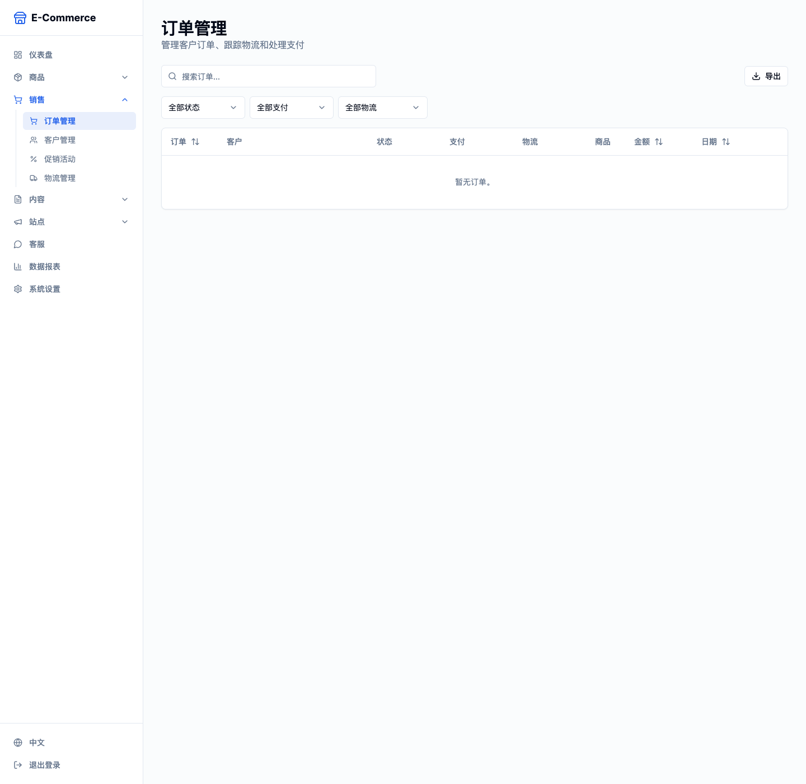

当前列表页可见内容如下：
- 搜索框
- 导出按钮
- 全部状态
- 全部支付
- 全部物流
- 订单表格
- “暂无订单”提示

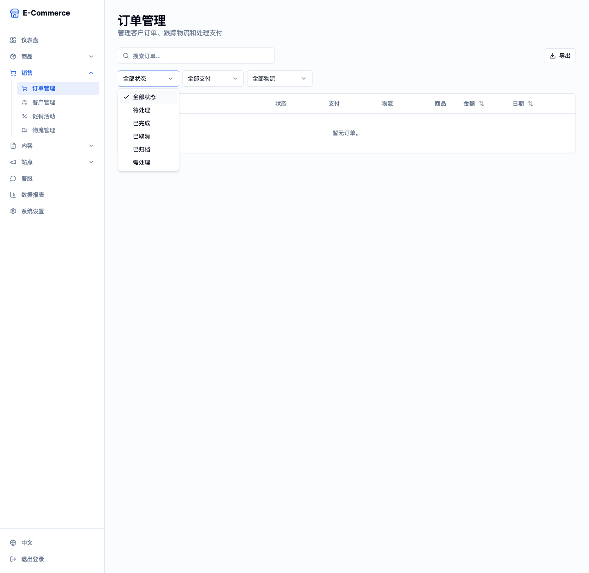

当前页面可见的订单状态选项包括：
- 全部状态
- 待处理
- 已完成
- 已取消
- 已归档
- 需处理

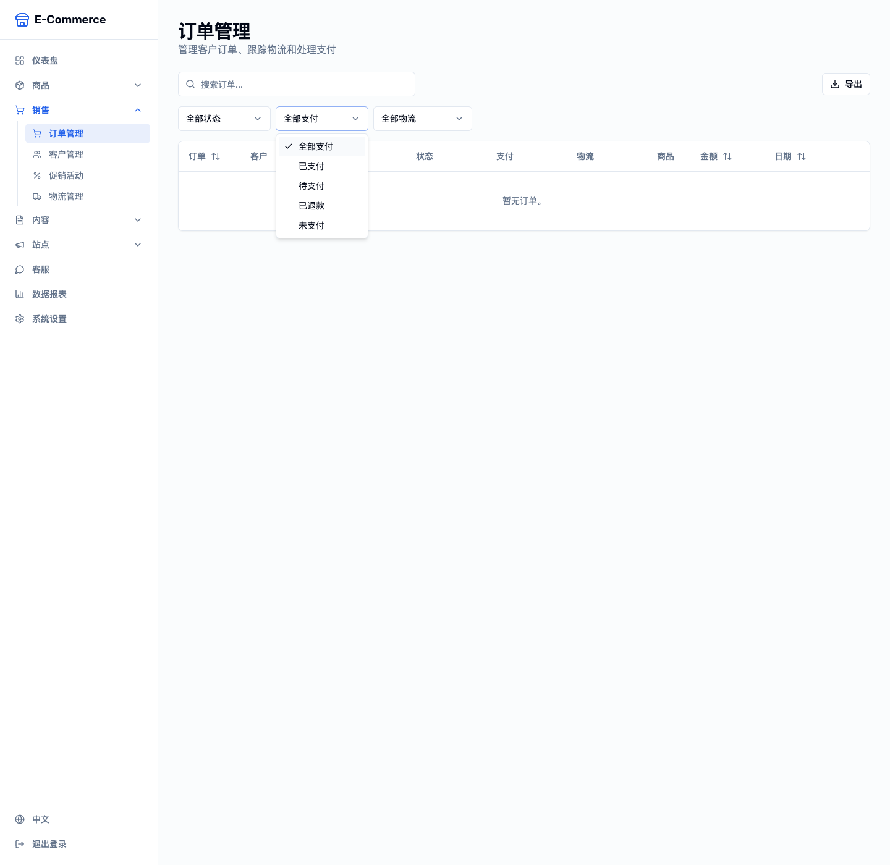

当前页面可见的支付状态选项包括：
- 全部支付
- 已支付
- 待支付
- 已退款
- 未支付

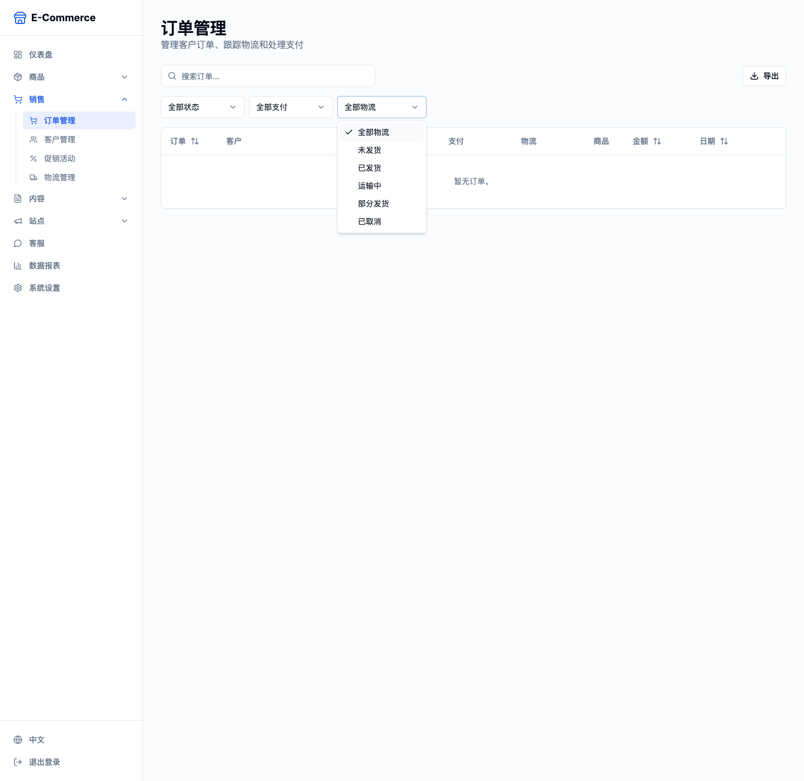

当前页面可见的物流状态选项包括：
- 全部物流
- 未发货
- 已发货
- 运输中
- 部分发货
- 已取消

### 6.3 操作步骤

当前后台可以按下面的方式使用订单管理页：

1. 从左侧菜单进入 `销售` → `订单管理`
2. 先看列表区域是否已有订单记录
3. 如果页面直接显示“暂无订单”，说明当前结果集中没有可显示的订单
4. 如需查找订单，可在搜索框输入关键词后观察列表变化
5. 如需缩小范围，可依次使用状态、支付、物流三个筛选入口
6. 如果筛选后仍然看不到数据，先把三个筛选项都恢复为“全部”
7. 如需保留当前查询结果，可使用右上角的导出按钮导出当前列表

当前页面没有真实订单记录，因此还看不到单笔订单详情、支付明细、物流明细或后续处理入口。

### 6.4 后台查看顺序

从后台运营的查看顺序来说，订单信息一般按下面的顺序进入视野：

1. 客户下单后，订单先进入后台订单列表
2. 运营先在订单管理列表中确认是否已经出现记录
3. 订单出现后，再结合列表中的状态、支付、物流三列判断当前订单处于哪个阶段
4. 只有列表中出现真实订单后，才有进一步核对单笔订单内容的基础

当前后台列表为空，因此本章能确认的真实页面停留在“订单列表与筛选入口”这一步。

### 6.5 常见问题

**1. 为什么订单列表里什么都没有？**

先把状态、支付、物流三个筛选项都恢复为“全部”。如果页面仍显示“暂无订单”，说明当前后台没有可显示的订单记录。

**2. 搜索不到订单怎么办？**

先清空搜索词，再重新查看列表。如果清空后仍然没有数据，优先判断当前不是搜索词问题，而是后台当前没有订单。

**3. 筛选后看不到任何记录怎么办？**

逐个把筛选项恢复为“全部”。如果恢复后页面重新出现数据，说明刚才的筛选条件过窄。

**4. 为什么现在不能继续处理订单？**

当前页面没有订单记录时，只能停留在列表页判断是否有数据，无法继续查看单笔订单内容。

---

## 第七章：品牌管理

### 7.1 模块概述

品牌管理用于维护品牌的基础资料，供前台商品详情页展示调用。运营日常最常接触的内容是品牌名称、品牌描述和 Logo。

从当前页面结构可以看出，品牌编辑页只负责维护品牌资料本身，不提供“关联商品”的编辑入口。这意味着：
- 品牌名称、描述、Logo 在“品牌管理”里维护
- 某个商品是否属于这个品牌，需要以商品编辑页里已选中的品牌为准

运营改完品牌资料后，最稳妥的检查入口是前台商品详情页中的品牌说明区。

### 7.2 界面导览

#### 品牌列表页

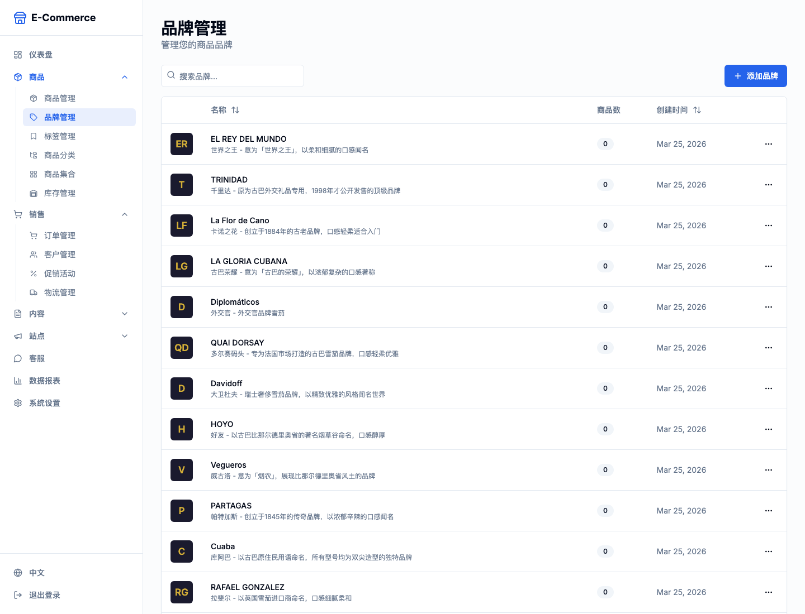

这里可以完成三件事：
- 用搜索框按品牌名称查找目标品牌
- 快速浏览品牌名称、简短描述和创建时间
- 通过右侧菜单进入编辑

#### 品牌编辑页

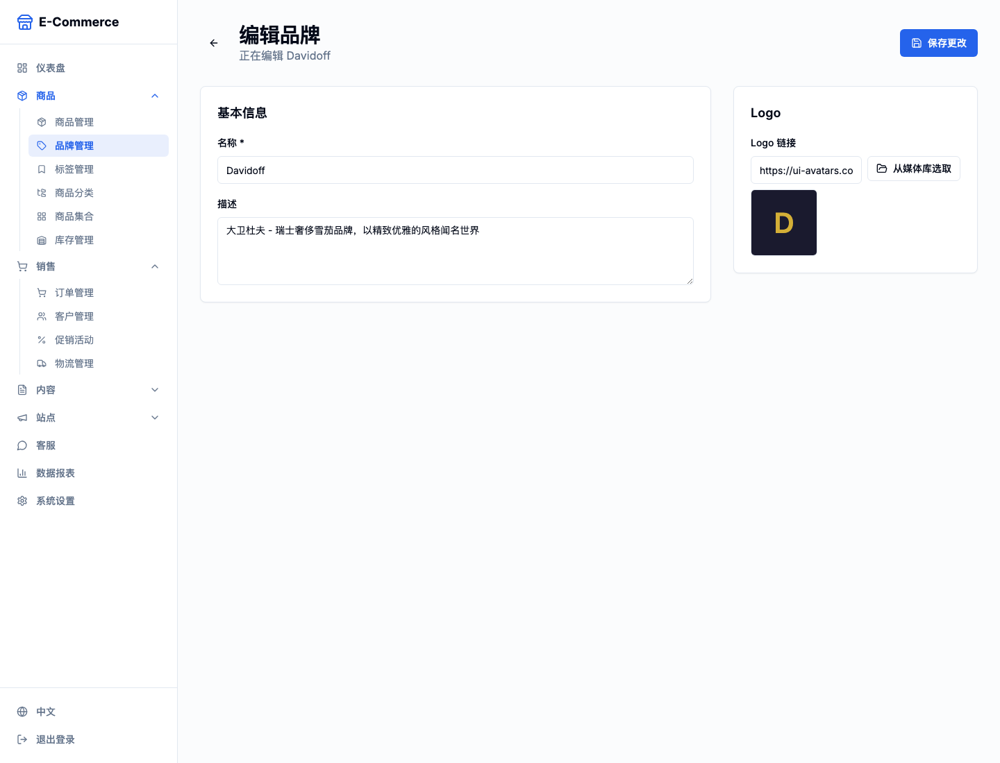

运营重点关注以下字段：
- 名称：前台展示给用户看到的品牌名称
- 描述：会影响前台商品详情页中的品牌介绍
- Logo 链接：品牌图标的图片地址，也可以从媒体库选择图片

#### 前台商品详情页中的品牌展示

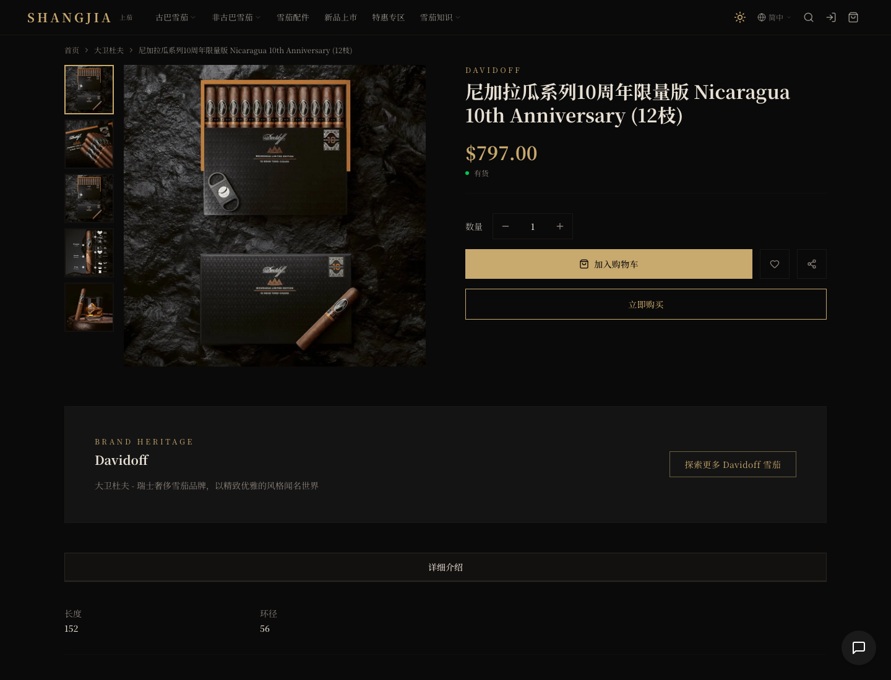

品牌信息会出现在商品详情页的品牌说明区。这里能直接看到：
- 品牌名称
- 品牌描述
- 品牌入口按钮

### 7.3 操作步骤

1. 在品牌列表页找到目标品牌
2. 进入编辑页，重点检查名称、描述和 Logo
3. 如果要确认某个商品是否已归到该品牌，回到商品编辑页查看该商品选择的品牌
4. 保存后打开一个属于该品牌的商品详情页，检查品牌说明区是否已经更新

### 7.4 后台到前台的对应关系

| 后台维护项 | 主要维护位置 | 会影响哪里 | 当前建议怎么检查 |
|---------|------------|----------|----------------|
| 品牌名称 | 品牌编辑页的名称 | 后台品牌列表名称、前台商品详情页品牌标题 | 以商品详情页为主 |
| 品牌描述 | 品牌编辑页的描述 | 后台品牌列表摘要、前台商品详情页品牌介绍 | 以品牌说明区为主 |
| Logo | 品牌编辑页的 Logo | 后台列表图标、编辑页预览 | 先看后台，再看商品详情页 |
| 商品与品牌的关联 | 商品编辑页中的品牌选择 | 前台商品详情页的品牌说明区 | 以商品详情页展示为准 |

### 7.5 常见问题

**1. 我改了品牌名称或描述，为什么前台还没变？**

先确认你打开的是这个品牌下的商品详情页，再刷新页面查看品牌说明区。

**2. 为什么品牌编辑页里找不到“关联商品”？**

因为当前品牌编辑页只维护品牌资料，不负责把商品挂到品牌名下。商品与品牌的关联要回到商品编辑页里设置。

**3. 后台列表里的“商品数”显示不准确怎么办？**

不要只靠这一列判断，前台商品详情页是否已经展示品牌说明，才是更直接的检查方式。

---

## 第八章：文章管理

### 8.1 模块概述

文章管理用于维护商城前台的内容文章，例如雪茄知识、品牌故事、活动资讯和活动专题。对后台运营人员来说，这一模块最重要的不是“把文章存进去”，而是把文章写清楚、分对类、配好封面图，并确认前台列表页、详情页和搜索展示信息都正确。

界面里会出现“SEO 搜索引擎优化设置”这一名称。本章统一把它理解为“搜索展示信息”，也就是用户在搜索结果页、社交分享卡片里更容易先看到的标题、摘要和配图。

这个模块主要解决 4 件事：
- 管理文章分类，保证前台栏目和后台归档一致
- 维护文章标题、摘要、正文和封面图
- 维护搜索展示信息，方便外部搜索和分享时展示更完整
- 控制发布时间、排序值和置顶显示，安排前台展示顺序

### 8.2 界面导览

#### 文章列表页

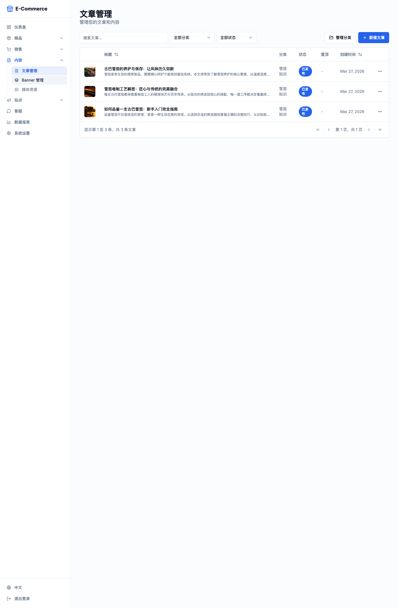

文章列表页适合用来查找、筛选和进入编辑。这里通常可以直接看到：
- 标题
- 摘要
- 分类
- 状态
- 是否置顶
- 创建时间

#### 分类管理界面

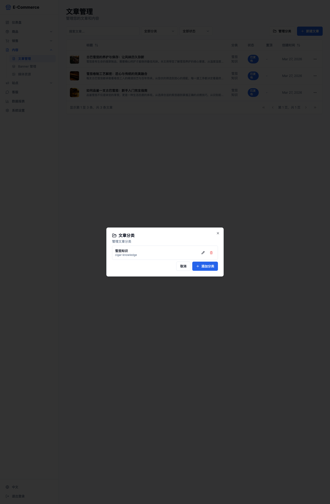

分类管理界面用于统一维护文章栏目。建议先把分类整理好，再开始发文。

#### 文章编辑表单

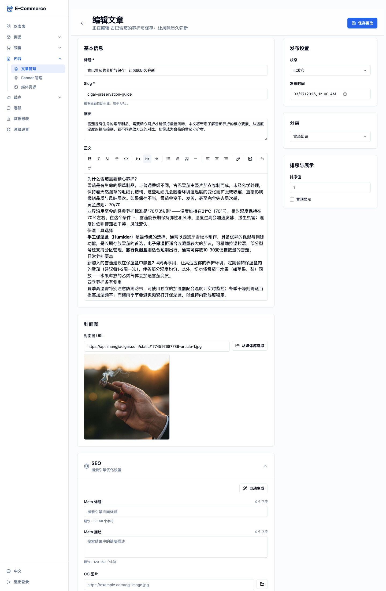

文章编辑表单主要负责维护：
- 标题
- 文章链接地址
- 摘要
- 封面图
- 发布时间、排序和置顶显示

#### 富文本编辑器

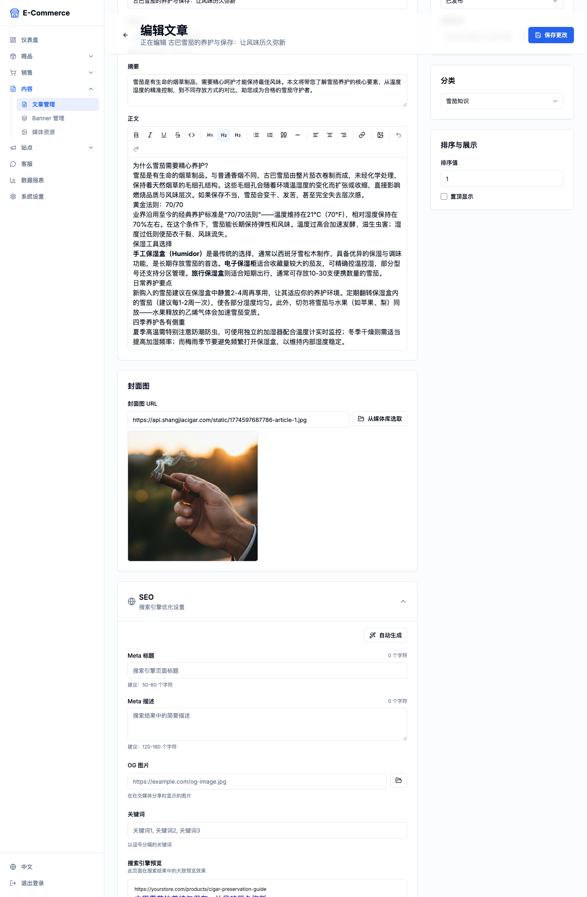

富文本编辑器用于撰写正文，是文章内容最核心的区域。

#### 搜索展示信息

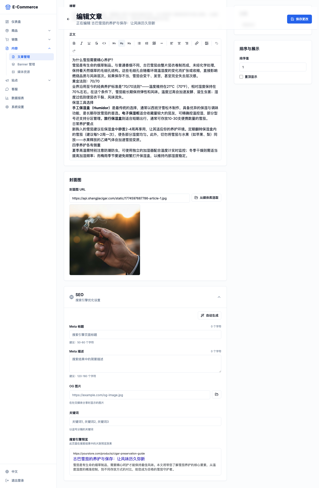

这里虽然写着“SEO 搜索引擎优化设置”，但运营可以把它当成“搜索展示信息”区域来维护。

#### 前台文章列表页

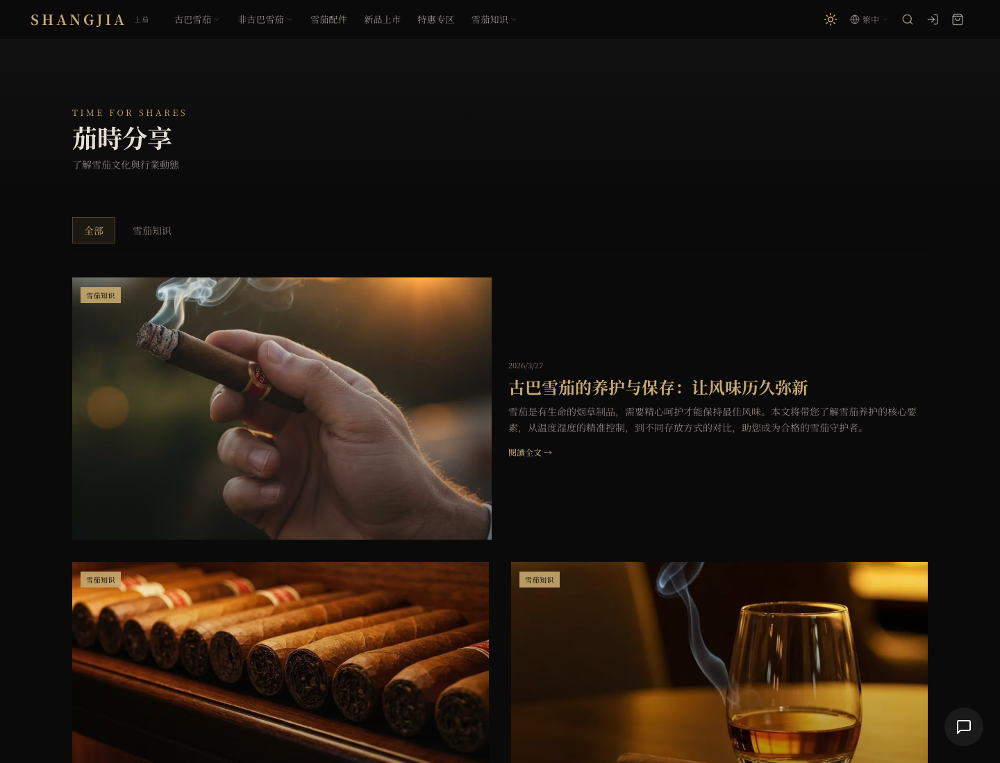

#### 前台文章详情页

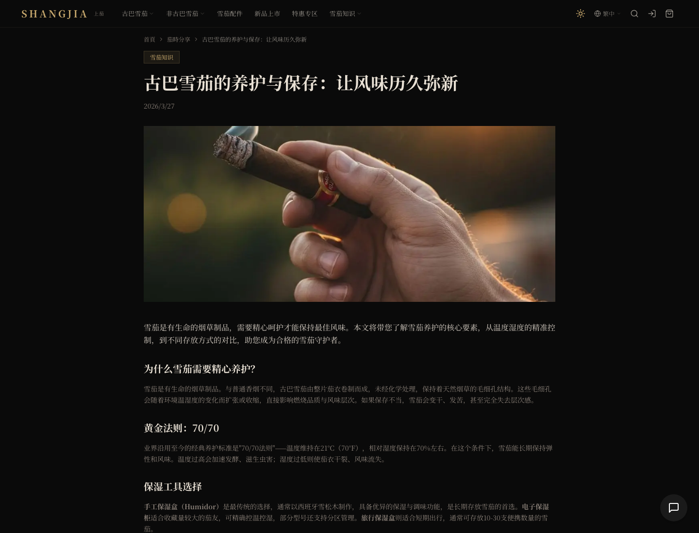

### 8.3 操作步骤

#### 第一步：先确认文章分类

1. 打开文章列表页
2. 进入“管理分类”
3. 确认要用的分类是否已存在
4. 分类名称尽量站在前台用户视角命名，例如“雪茄知识”“新品资讯”

#### 第二步：填写文章基础信息

1. 点击“新建文章”或进入已有文章编辑页
2. 先填写标题，让用户一眼知道文章主题
3. 再检查文章链接地址，建议简短、稳定，不要频繁改动
4. 在摘要里用 1 到 2 句话说明文章价值

#### 第三步：完成正文与封面图

1. 在富文本编辑器中撰写正文
2. 先整理小标题和段落结构，再补充细节
3. 上传或选择封面图

#### 第四步：维护搜索展示信息

1. 打开“搜索展示信息”区域
2. 可以先用系统自动生成，再按活动主题或投放场景微调
3. 重点检查搜索标题、搜索描述和分享图是否与文章主题一致

#### 第五步：保存后核对前台

1. 保存后先回前台文章列表页看文章卡片
2. 再打开文章详情页，检查标题、摘要、正文层次和封面图
3. 如有重点活动或专题内容，再额外检查分享出去时的标题和配图

### 8.4 后台到前台的对应关系

| 后台字段 | 运营填写重点 | 前台主要展示位置 |
|---------|-------------|----------------|
| 分类 | 决定文章归属栏目，名称要统一 | 文章列表页分类筛选、文章卡片分类标签、详情页分类标签 |
| 标题 | 直接说明文章主题 | 文章列表标题、文章详情页主标题 |
| 摘要 | 用 1 到 2 句话讲清文章看点 | 文章列表摘要、详情页顶部简介 |
| 正文 | 按小标题和段落组织内容 | 文章详情页正文区域 |
| 封面图 | 选择与文章主题对应的主图 | 文章列表卡片配图、文章详情页顶部主图 |
| 文章链接地址 | 保持简短、稳定 | 文章详情页网址 |
| 搜索标题 / 搜索描述 / 分享图 | 单独优化搜索和分享时的展示 | 搜索结果、社交分享卡片 |
| 发布时间 | 安排文章何时对外展示 | 文章列表日期、详情页日期 |
| 排序值 / 置顶显示 | 决定同一栏目中的展示顺序 | 文章列表排序、首页文章推荐区优先级 |

### 8.5 常见问题

**1. 文章在后台已经有了，前台却看不到？**

先检查状态是否为已发布、发布时间是否已经到达、分类是否选对，然后再回前台文章列表页查看。

**2. 前台文章卡片没有图，或分享时图片不对？**

优先检查封面图是否已经填写；如果是分享场景图片不对，再检查搜索展示信息里的分享图。

**3. 前台列表页摘要显示不理想？**

前台列表页优先读取摘要，而不是整篇正文。遇到摘要太长或与标题重复时，应直接回摘要字段调整。

---

## 第九章：多语言内容管理

### 9.1 模块概述

多语言内容统一在 `设置` → `翻译` 维护。运营人员先在商品、文章、首页 Banner、菜单、公告等业务页面录入一份基础内容，再回到翻译中心补充其它语言版本。前台切换到对应语言后，会优先显示这里维护的译文。

维护口径如下：
- 多语言只有一个统一入口：`设置` → `翻译`
- 业务页面负责建立基础内容，不在各业务页面分别重复维护多语言版本
- 翻译完成后，要到前台切换对应语言，检查是否已经生效

| 内容类型 | 在翻译中心可补充的内容 | 前台常见查看位置 |
|---------|----------------------|----------------|
| 商品 | 标题、副标题、描述等 | 商品列表卡片、商品详情页 |
| 商品分类 | 名称、描述 | 分类页标题、分类说明 |
| 文章 | 标题、摘要、正文 | 文章列表、文章详情 |
| 品牌 | 名称、描述 | 商品中的品牌信息 |
| 菜单项 | 菜单名称 | 顶部导航、页脚链接 |
| Banner | 标题、副标题、按钮文字 | 首页轮播 Banner |
| 公告 | 公告文字 | 顶部公告栏 |
| 商品合集 | 名称、说明 | 首页合集区块或相关专题页 |

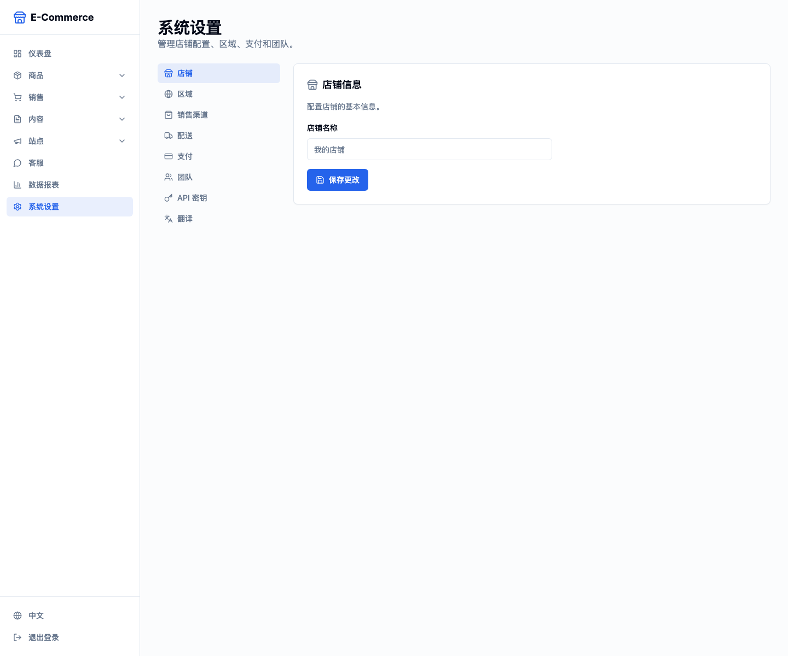

### 9.2 界面导览

#### 统一入口

进入后台后，先打开 `设置`，再切到 `翻译`。这里是所有多语言内容的统一入口。

#### 翻译进度

翻译首页会先显示目标语言和整体完成度，方便先判断当前语言还有哪些内容未补齐。

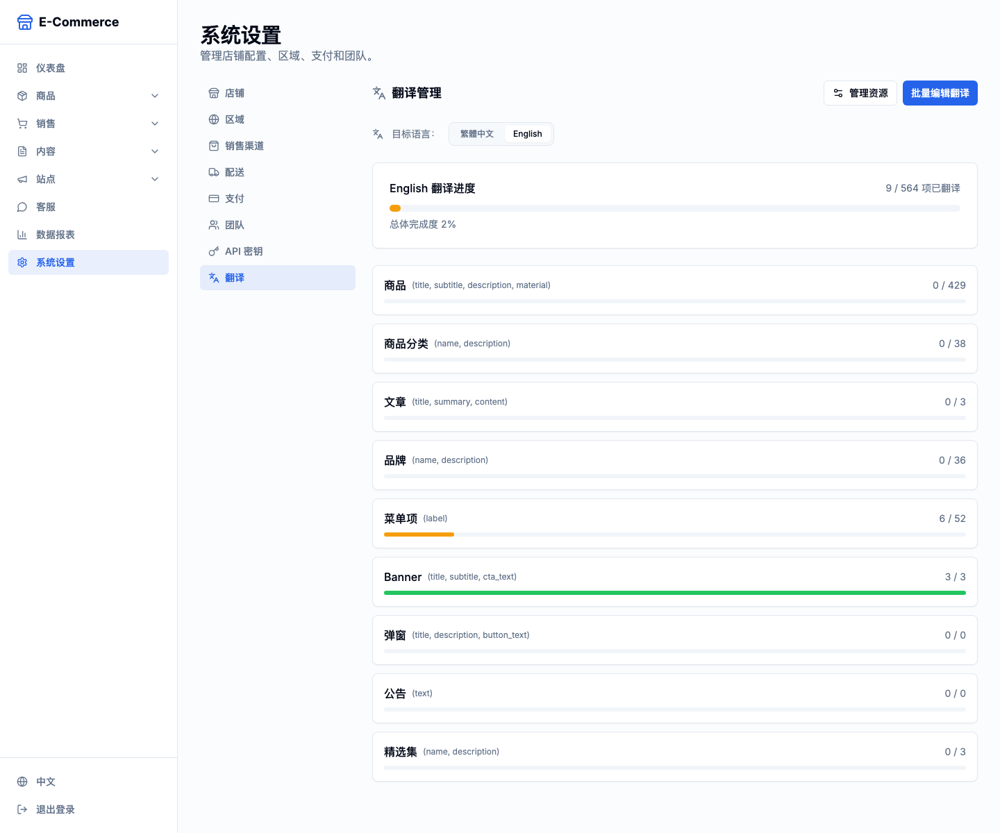

#### 内容类型与字段范围

点击“管理资源”后，可以查看当前哪些内容类型支持翻译，以及每种内容开放了哪些字段。

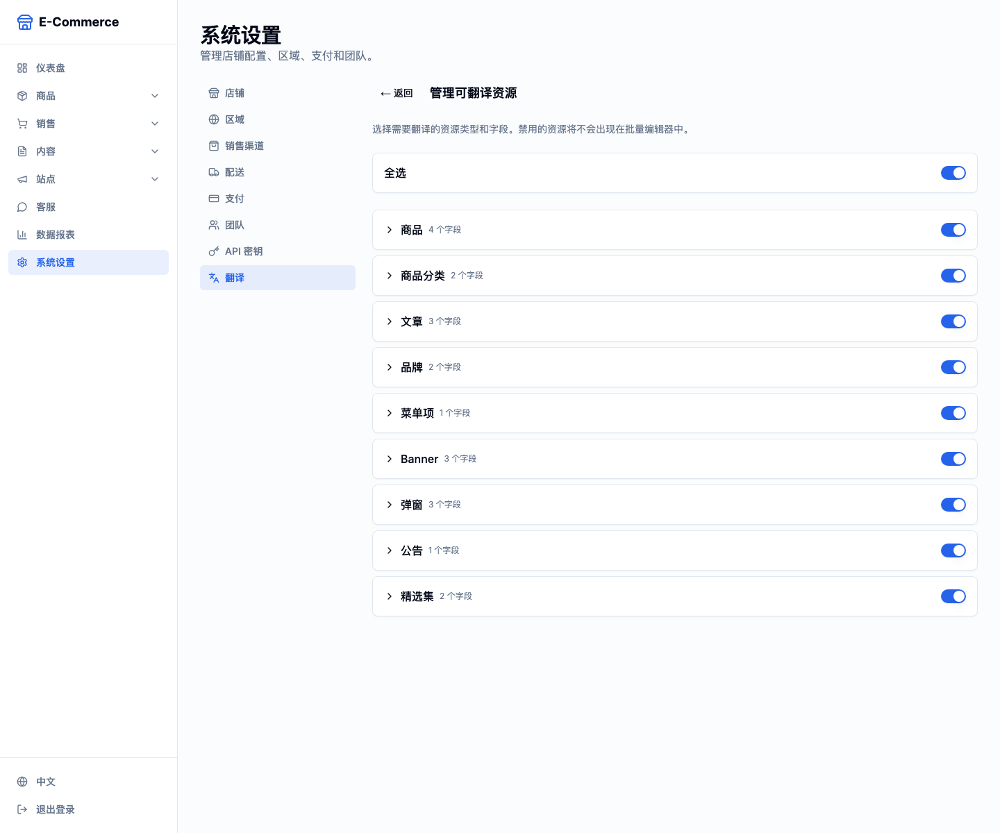

#### 批量编辑区

点击“批量编辑翻译”后，页面上方会显示内容类型列表，下方按“原文 / 目标语言”成对展示字段。

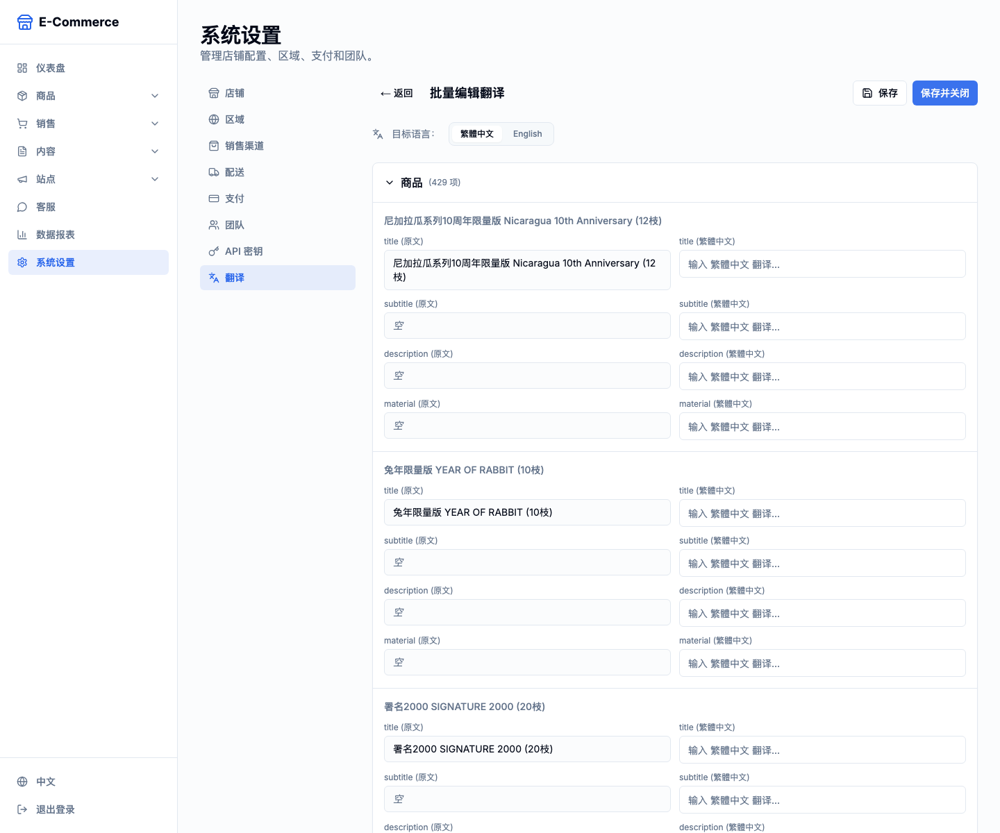

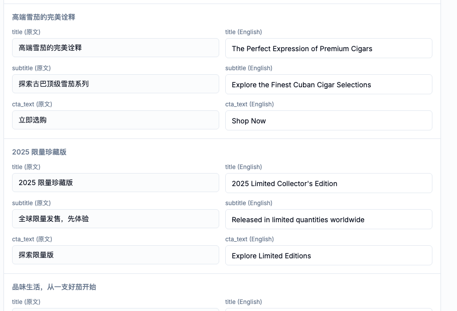

#### 前台查看入口

前台右上角有语言切换器，可在不同语言之间切换。翻译完成后，建议从这里切换语言，再查看首页、导航、商品页、文章页等位置是否已经生效。

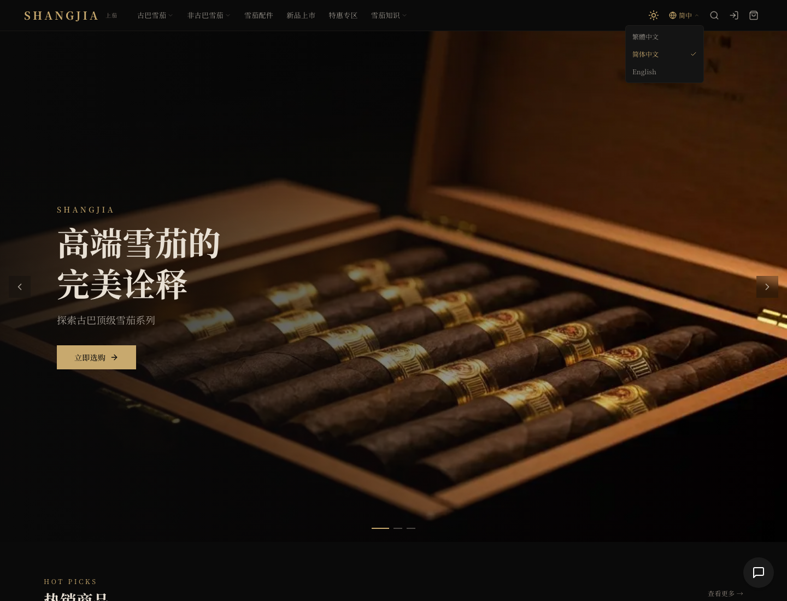

### 9.3 操作步骤

#### 第一步：先在业务页面录入基础内容

商品、文章、品牌、菜单、Banner、公告、商品合集等内容，先在各自业务页面建立基础内容。多语言不是在这些页面分别维护，而是统一回到翻译中心补充。

#### 第二步：打开统一入口 `设置` → `翻译`

进入翻译中心后，先确认本次要维护的目标语言。

#### 第三步：先看翻译进度，再确定优先级

如果要优先检查首页效果，通常先看：
- 菜单项
- Banner
- 首页相关商品文案
- 公告

如果要补内容页，再重点看：
- 文章
- 商品分类
- 品牌
- 商品合集

#### 第四步：如需确认范围，先打开“管理资源”

这里可以确认当前哪些内容类型已纳入翻译中心，以及每种内容开放了哪些字段。

#### 第五步：进入“批量编辑翻译”逐条补充

1. 先在页面上方选择内容类型
2. 再按条目查看原文
3. 在目标语言输入框中补充对应内容
4. 完成一类内容后及时保存，避免切换页面造成遗漏

#### 第六步：切到前台检查是否生效

打开前台首页，使用页头右上角语言切换器切到目标语言，然后根据内容类型检查对应位置：
- 菜单项：看顶部导航和页脚链接
- Banner：看首页轮播标题、副标题和按钮文字
- 商品：看商品卡片、商品详情页标题和说明
- 文章：看文章列表和文章详情页
- 商品分类、品牌、商品合集：看对应标题和说明
- 公告：如当前前台有启用内容，再检查顶部公告栏

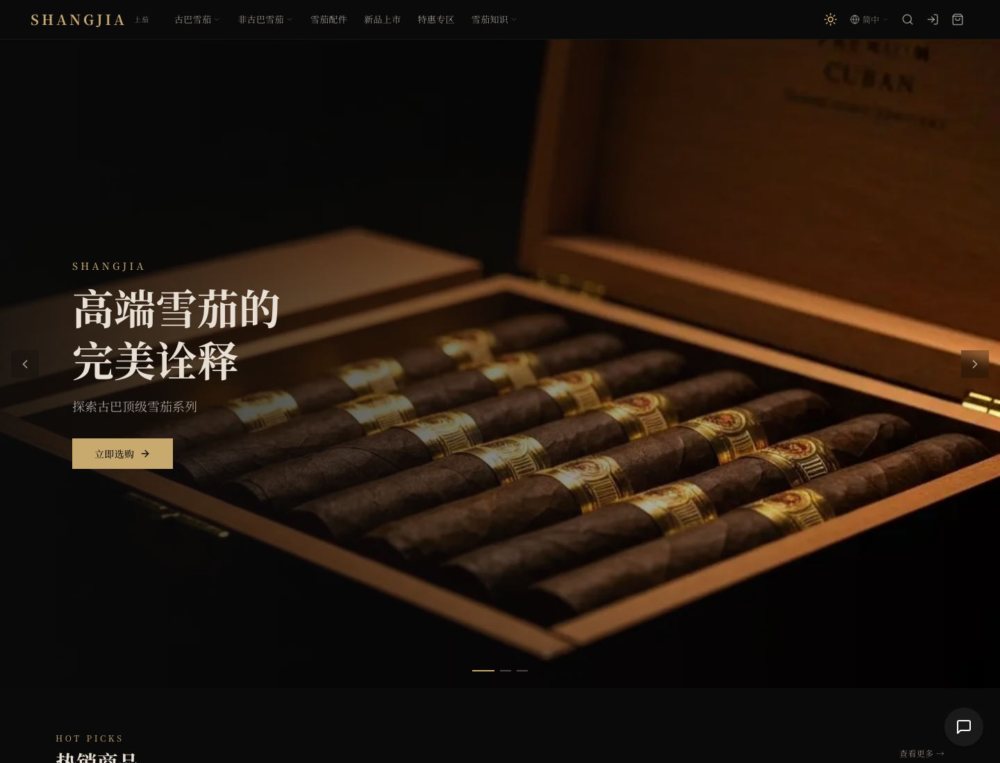

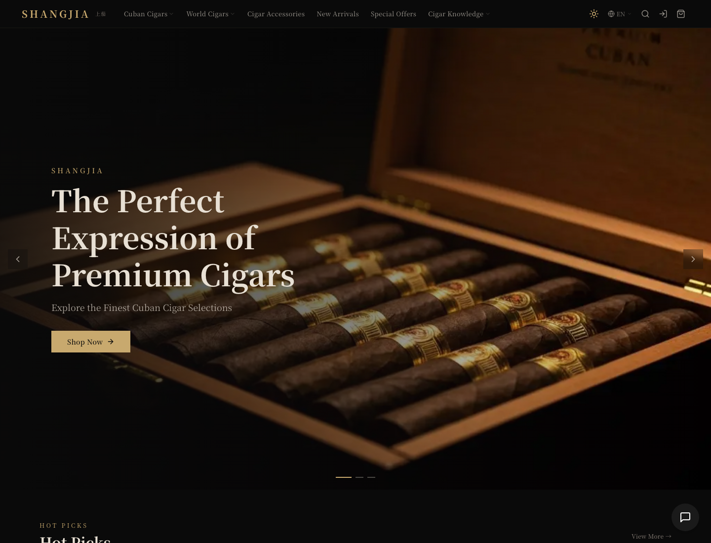

### 9.4 后台到前台的对应关系

| 内容类型 | 基础内容先在哪里维护 | 多语言统一去哪里补充 | 切换前台语言后重点检查哪里 |
|---------|------------------|--------------------|------------------------|
| 商品 | 商品管理 | `设置` → `翻译` → `商品` | 商品列表卡片、商品详情页 |
| 商品分类 | 商品分类管理 | `设置` → `翻译` → `商品分类` | 分类页标题、分类说明 |
| 文章 | 文章管理 | `设置` → `翻译` → `文章` | 文章列表、文章详情 |
| 品牌 | 品牌管理 | `设置` → `翻译` → `品牌` | 商品中的品牌信息 |
| 菜单项 | 菜单管理 | `设置` → `翻译` → `菜单项` | 顶部导航、页脚链接 |
| Banner | Banner 管理 | `设置` → `翻译` → `Banner` | 首页轮播图 |
| 公告 | 公告管理 | `设置` → `翻译` → `公告` | 顶部公告栏 |
| 商品合集 | 商品合集管理 | `设置` → `翻译` → `商品合集` | 首页合集区块标题和说明 |

### 9.5 常见问题

**1. 为什么翻译中心里看不到刚新建的内容？**

先确认基础内容是否已经在对应业务页面成功建立；如果基础内容还没建立，翻译中心不会出现。

**2. 为什么翻译中心里没有简体中文？**

当前维护方式是先在业务页面录入基础内容，再在翻译中心补充其它目标语言，因此业务页面本身就是第一份基础文案的维护位置。

**3. 为什么前台切换语言后没有变化？**

先检查是否已经在翻译中心保存；再检查当前看的页面是否正好对应这类内容。

**4. 商品、文章、Banner 这些内容需要回到各业务页面分别写多份吗？**

不需要。业务页面只负责基础内容，多语言版本统一在翻译中心维护。

---

## 第十章：前台用户旅程

### 10.1 首次访问体验

本章用前台实拍页面说明用户从进入网站到登录后查看账户的主要路径，以及各关键区块大致来自哪个后台模块。它适合帮助运营、内容和产品同事理解：用户第一次来到网站时，真正会依次看到什么。

#### 首次访问先看到年龄验证提示

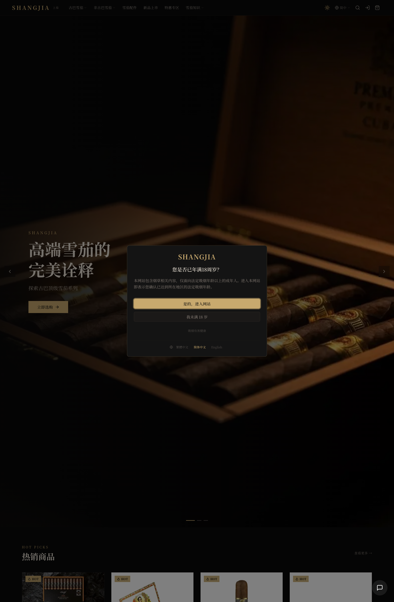

用户第一次进入网站时，不会立刻看到商品，而是先看到年龄验证提示。这一步是前台旅程的真正起点，决定用户能否继续浏览。

#### 通过验证后进入首页

首页承担“先吸引、再分流”的作用。用户进入首页后，通常会连续看到：
- 顶部导航
- 首页轮播
- 商品精选区块
- 内容文章区块
- 页脚链接

首页关键区块与后台来源可按下表理解：

| 首页区块 | 用户会看到什么 | 后台来源 |
|---------|---------------|---------|
| 顶部导航、页脚快速链接 | 用户进入不同大类、内容页和帮助页的主要入口 | 菜单管理 |
| 首屏轮播图 | 活动主题、品牌主推信息、活动入口 | Banner 管理 |
| 热销商品、焦点推介、限量版 | 运营精选的商品区块 | 商品合集管理 + 商品管理 |
| 文章推荐区 | 知识内容和专题内容 | 文章管理 |
| 顶部公告条 | 促销通知、发货说明、节日提醒 | 公告管理 |

#### 用户通过顶部导航决定下一步去哪里

多数用户不会一进站就搜索，而是先从导航判断这个站卖什么、怎么分区、有没有自己感兴趣的栏目。

### 10.2 浏览商品

用户通常会通过两条路径进入商品浏览阶段：一条是从首页或导航进入分类页，另一条是直接搜索关键词。

#### 从导航进入分类页浏览商品

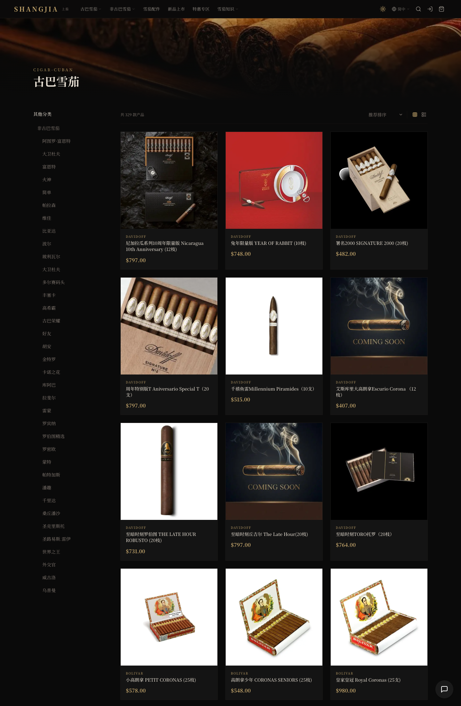

分类页是用户批量比较商品的主要页面。这里通常会看到：
- 分类名称
- 同级分类入口
- 商品数量
- 排序方式
- 商品卡片列表

分类页的常见信息来源如下：

| 用户看到的内容 | 后台来源 |
|---------------|---------|
| 分类名称、分类层级、分类入口 | 商品分类管理 |
| 商品图片、商品名称、价格、库存状态 | 商品管理 |
| 商品总数与排序后的展示结果 | 商品管理 |

#### 用户直接搜索关键词找商品

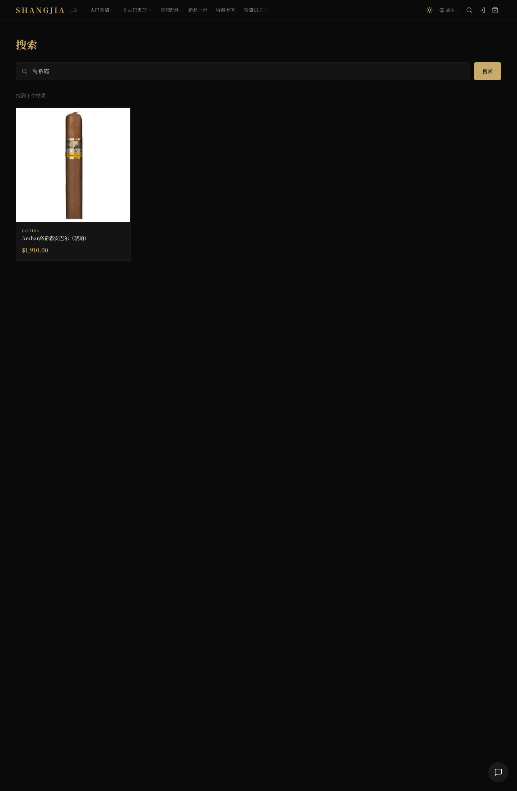

搜索页更像“带目标来购物”的入口。对内容和商品运营来说，这意味着商品命名、品牌信息和上架状态都会直接影响搜索能不能命中。

### 10.3 商品详情

当用户在分类页或搜索页找到感兴趣的商品后，接下来会进入商品详情页完成“确认值不值得买”的判断。

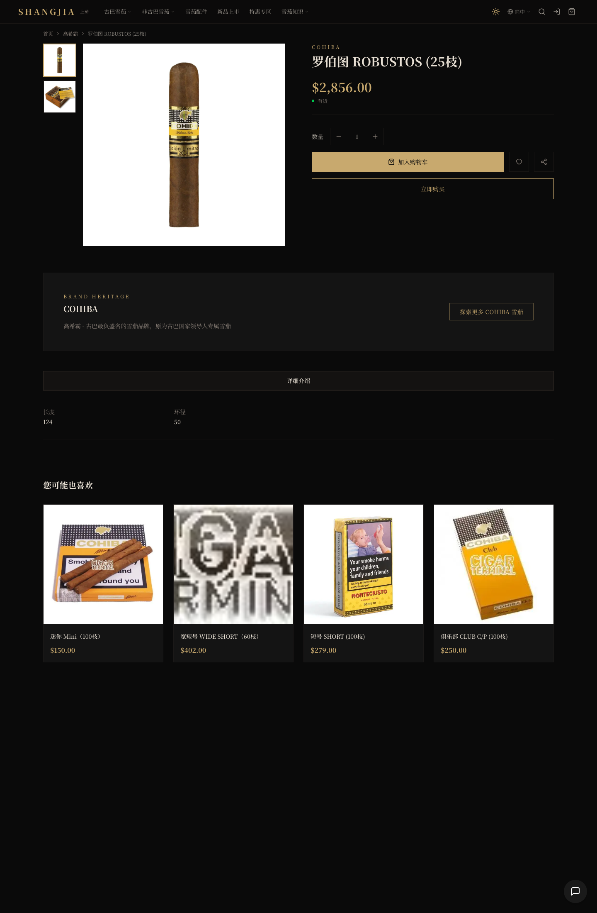

商品详情页中，用户通常会看到：
- 面包屑与归属分类
- 品牌信息
- 商品名称
- 价格和库存状态
- 数量选择
- 加入购物车 / 立即购买按钮
- 品牌故事、规格参数和相关推荐

| 详情页区块 | 用户会看到什么 | 后台来源 |
|-----------|---------------|---------|
| 面包屑与分类 | 知道自己正在看哪一类商品 | 商品分类管理 |
| 品牌名与品牌说明 | 理解品牌定位与背书 | 品牌管理 |
| 商品标题、价格、库存、购买按钮 | 做购买决策的核心信息 | 商品管理 |
| 规格参数 | 用于比较与筛选的细节信息 | 商品管理 |
| 相关推荐 | 继续比较或加购的入口 | 商品管理 |

### 10.4 购物流程

#### 用户把商品加入购物车后查看汇总

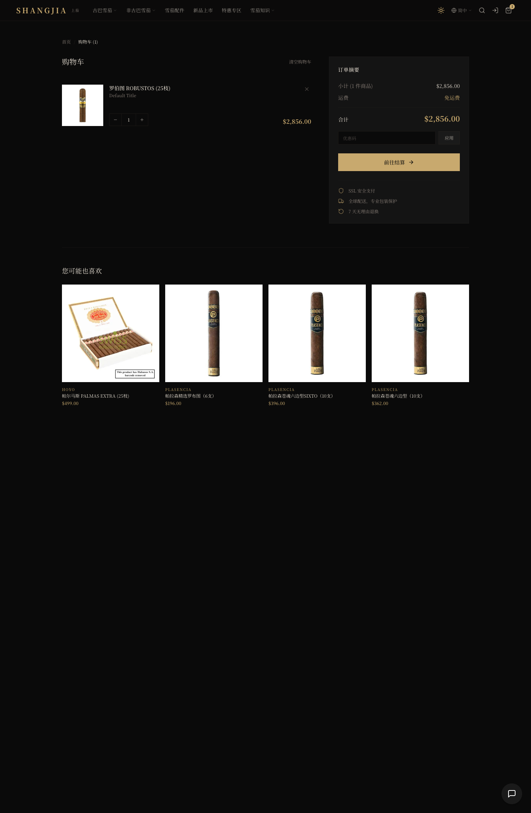

购物车页承担“临门一脚前的整理工作”。用户会在这里复核商品、调整数量、查看金额，并决定是否继续结账。

| 购物车区块 | 后台来源 |
|-----------|---------|
| 商品名称、缩略图、单价、数量 | 商品管理 |
| 优惠码输入框与优惠逻辑入口 | 促销管理 |
| 小计、合计等金额汇总 | 基于当前购物车内容实时展示 |

#### 登录后进入结账页

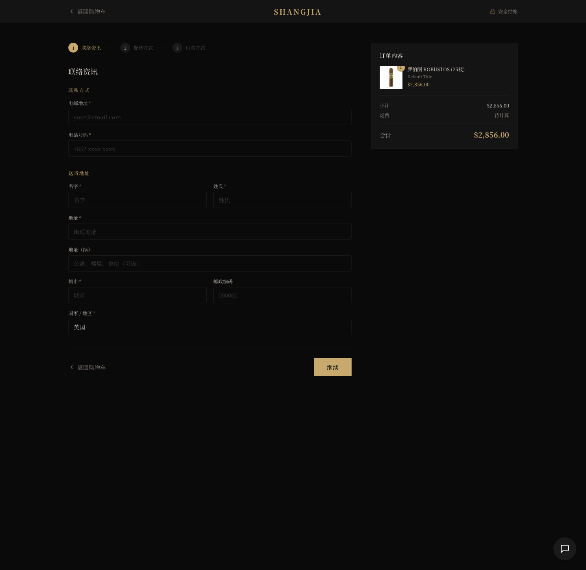

登录后的结账页会展示联系信息、收货信息、配送方式、付款方式和订单内容。

| 结账页区块 | 后台来源 |
|-----------|---------|
| 联系方式、已保存地址 | 客户管理 |
| 商品名称、价格、小计、合计 | 商品管理与当前购物车内容 |
| 最终生成的订单记录 | 订单管理 |

#### 订单结果入口需要登录

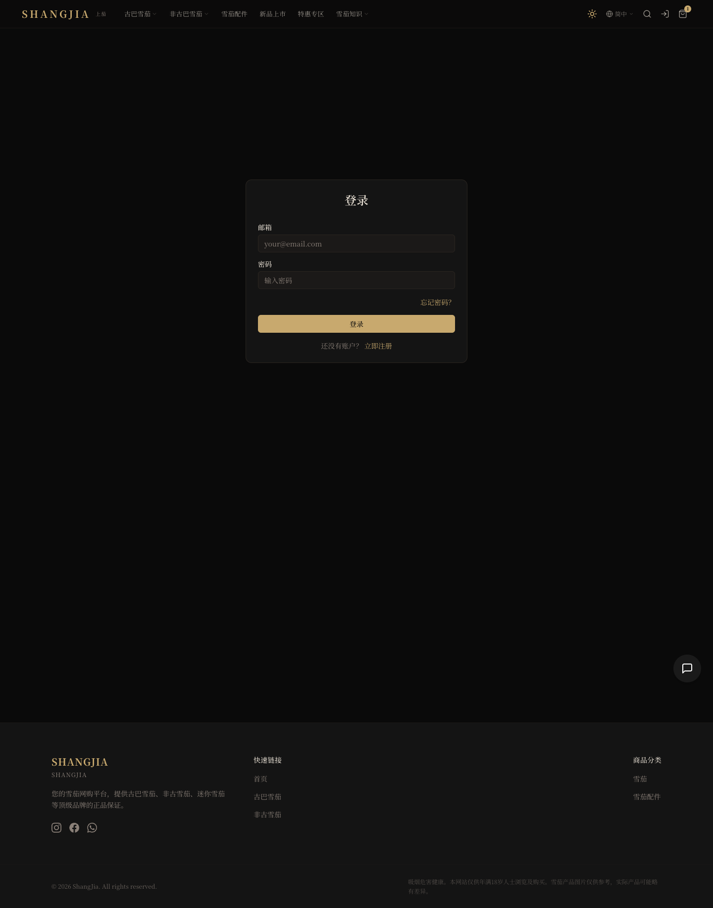

订单结果页属于登录后的后续页面。用户如果未登录，通常需要先回到账户体系中完成身份确认。

### 10.5 账户管理

#### 新用户进入注册页

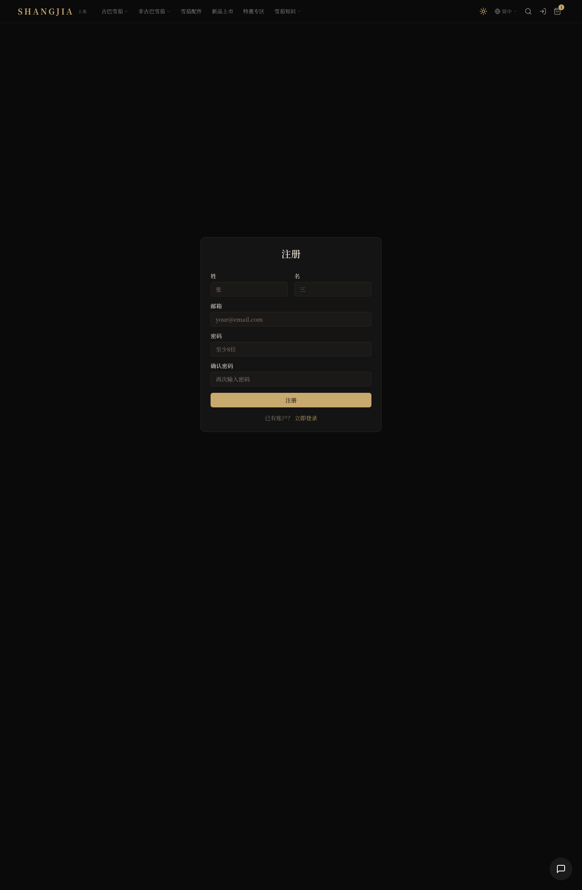

注册页负责把访客变成可识别的客户。对运营来说，注册页文案是否清楚、字段是否必要、跳转是否顺畅，会直接影响新客进入率。

#### 已登录用户进入账户概览页

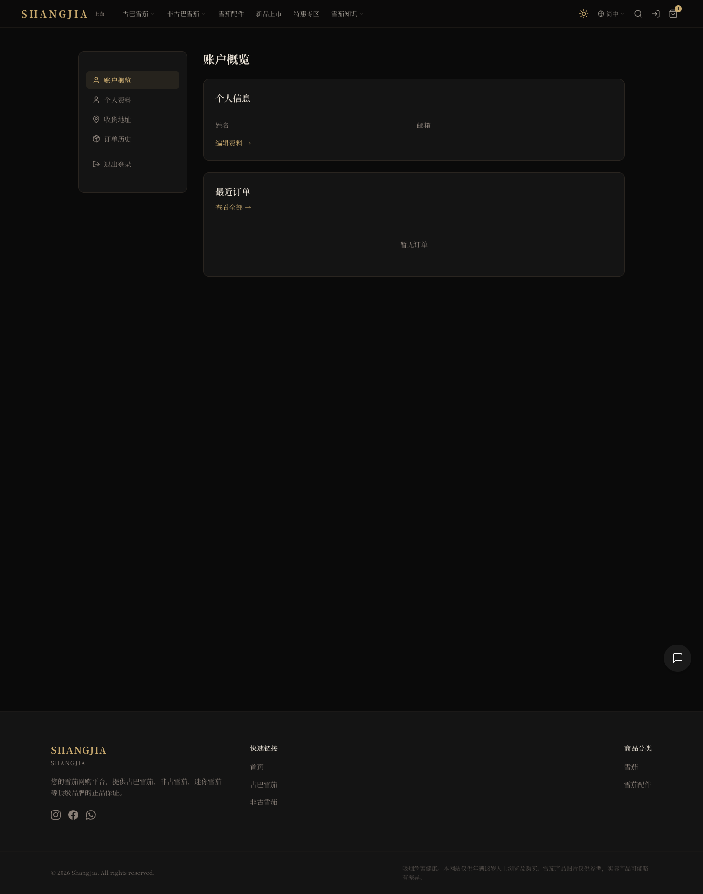

账户概览页是用户登录后的个人中心入口。这里通常会看到：
- 账户概览
- 个人资料
- 收货地址
- 订单历史
- 退出登录

| 账户页区块 | 后台来源 |
|-----------|---------|
| 姓名、邮箱、个人资料、收货地址 | 客户管理 |
| 最近订单、订单历史 | 订单管理 |

---

## 第十一章：其他功能模块

### 11.1 标签管理

**模块作用：**
标签用于给商品补充醒目的短文案，适合标注“新品”“限量版”“5 支 / 盒”这类信息。标签本身不会单独出现在前台，通常需要先创建，再到商品编辑页关联到具体商品。

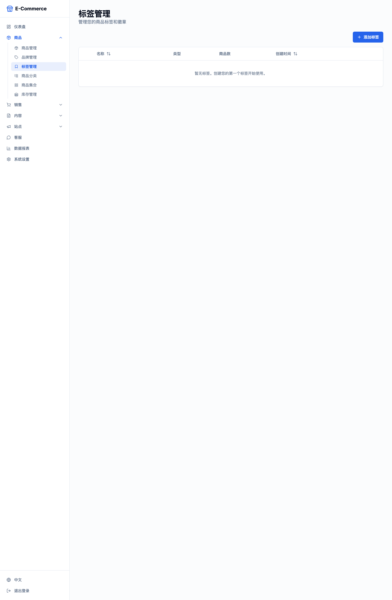

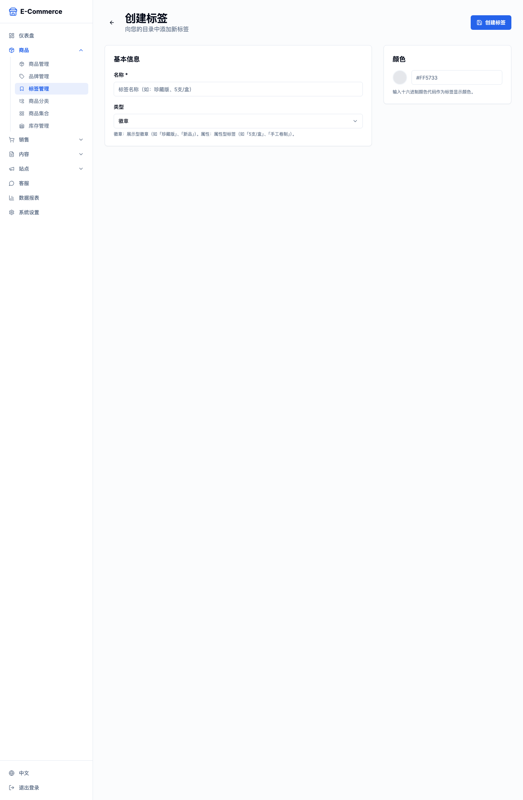

**关键点：**
- 列表页重点看名称、类型、商品数和创建时间
- 新建页重点看名称、类型和颜色
- 如果只创建标签但没有关联商品，前台不会发生变化

### 11.2 商品分类管理

**模块作用：**
商品分类用于整理商城目录结构，决定商品归在哪个分类页下展示。它是用户浏览分类页、筛选商品和理解商品结构的重要基础。

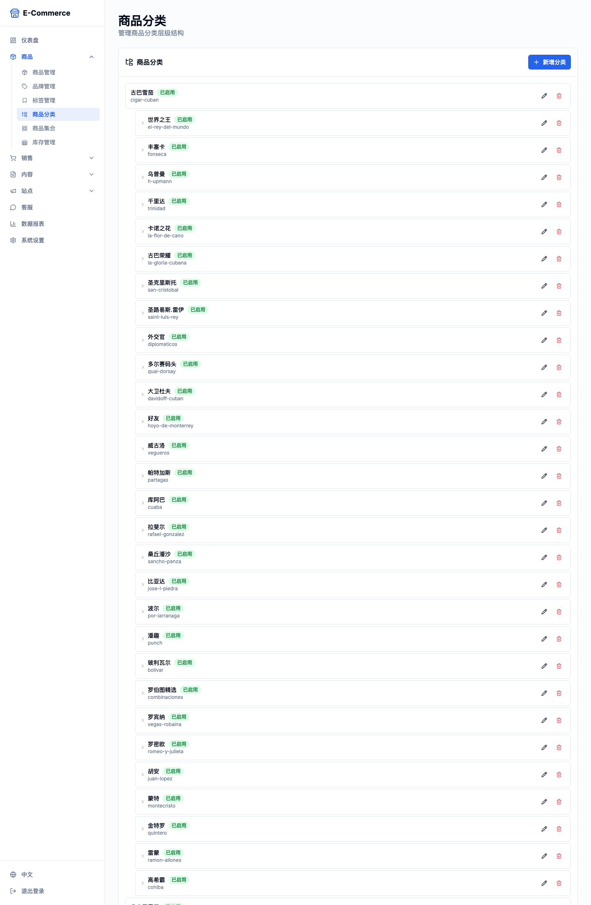

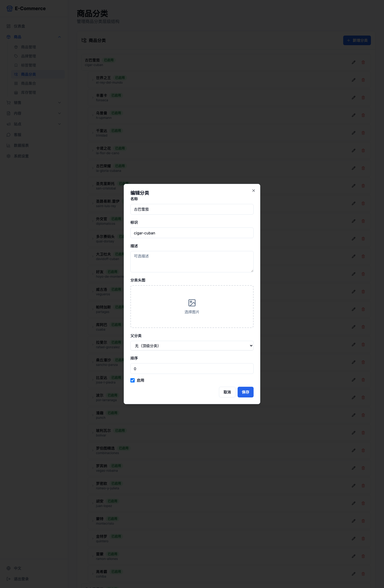

**关键点：**
- 列表页以树状方式展示分类层级
- 编辑面板重点看名称、链接标识、描述、父分类、排序和启用
- 修改链接标识后，原有分类链接、菜单跳转或外部分享地址都应一起检查

### 11.3 公告管理

**模块作用：**
公告管理用于维护网站顶部公告条，适合发布发货提醒、节假日安排、活动说明、包邮政策等需要全站提醒的信息。

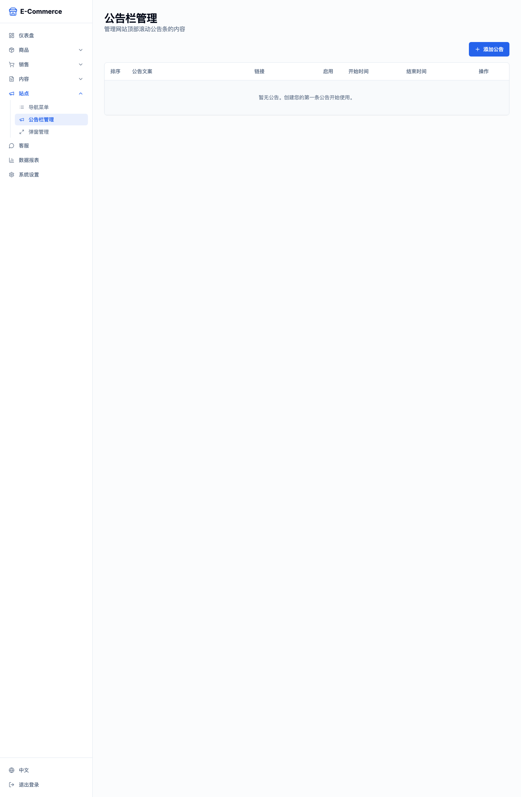

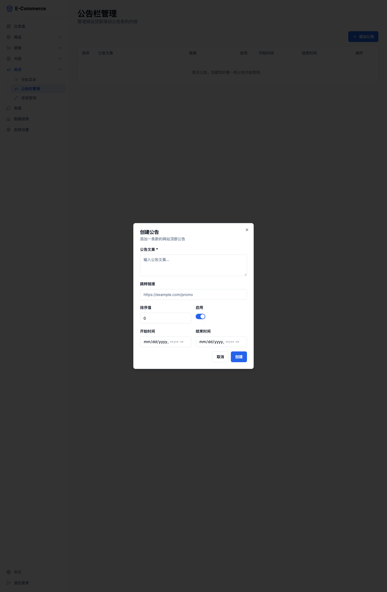

**关键点：**
- 列表页重点看排序、公告文案、链接、启用、开始时间和结束时间
- 创建区域重点看公告文案、跳转链接、排序值、启用开关和时间范围
- 没有启用中的公告时，前台不会显示公告条

### 11.4 客户管理

**模块作用：**
客户管理用于查看平台注册客户的信息，方便客服、售后和会员运营人员按姓名或邮箱查人、核对资料、跟进订单和地址信息。

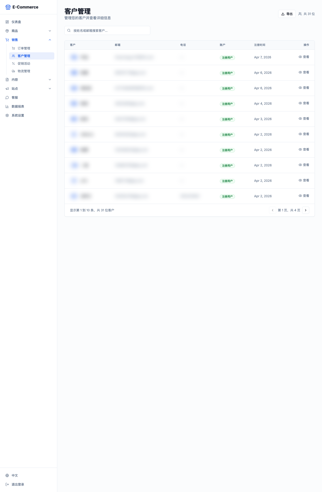

**关键点：**
- 列表页重点看客户、邮箱、电话、账户和注册时间
- 页面支持搜索和导出
- 该模块主要影响客服和会员运营流程，不直接改变首页或商品页展示

### 11.5 促销管理

**模块作用：**
促销管理用于创建折扣活动和优惠码，是运营做节日活动、新客优惠、限时折扣时最常用的辅助模块之一。

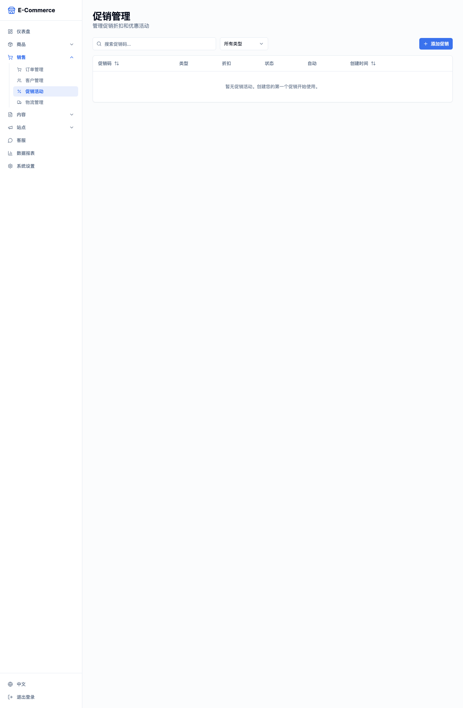

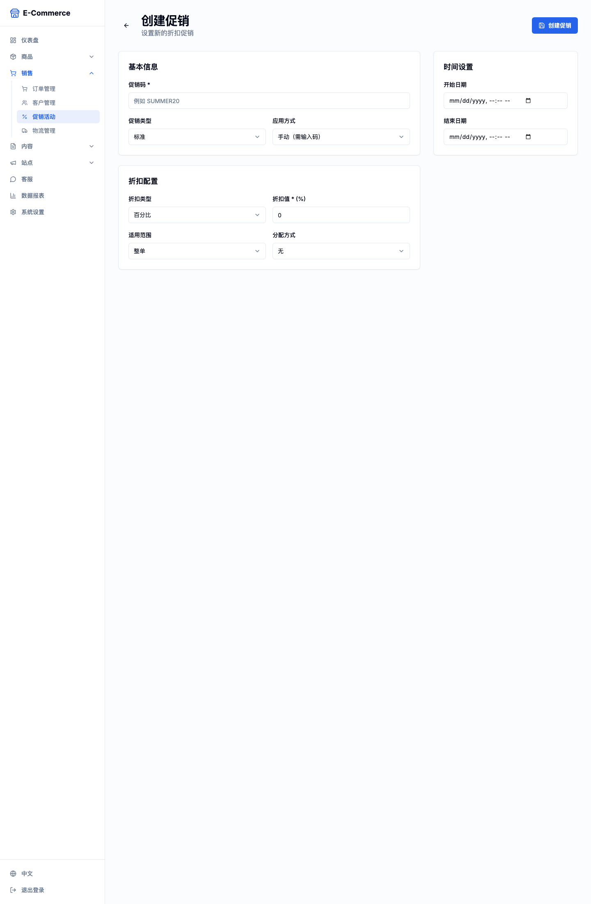

**关键点：**
- 列表页重点看促销码、类型、折扣、状态和创建时间
- 新建页重点看促销码、促销类型、折扣值、适用范围和活动时间
- 该模块会直接影响购物车和结账页的优惠码使用结果

### 11.6 库存管理

**模块作用：**
库存管理用于跟踪商品库存数量和状态，帮助运营提前发现低库存、缺货和待补货情况。

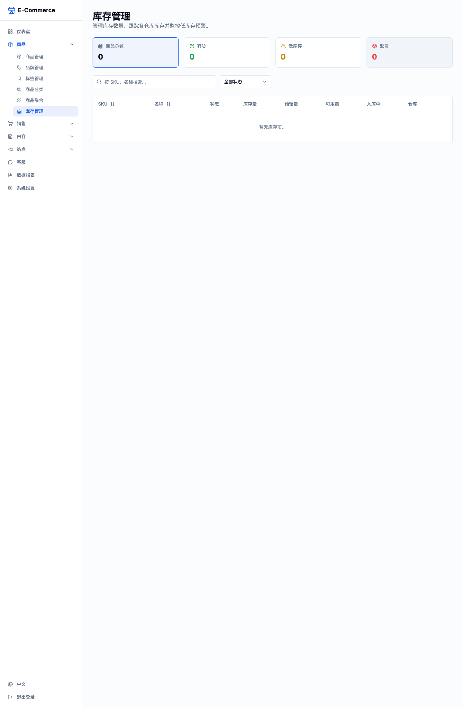

**关键点：**
- 页面顶部可快速看到商品总数、有货、低库存、缺货等统计
- 列表区重点看商品编码、名称、状态、库存量和可用量
- 库存状态会影响前台商品的有货、缺货判断，以及用户是否能正常下单

### 11.7 系统设置

**模块作用：**
系统设置用于维护店铺的基础配置，是全站级设置的集中入口。这里的内容通常不会只影响某一个页面，而是影响整个平台的运行方式。

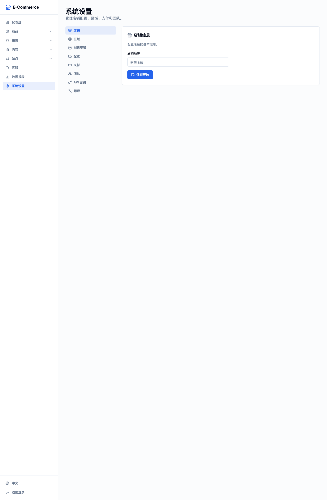

**关键点：**
- 页面上方可切换店铺、区域、销售渠道、配送、支付、团队、翻译等分栏
- 这类设置通常不需要高频改动，但每次改动都应先明确影响范围
- 与商品、公告这类内容型模块不同，这里的修改更适合在明确变更目的后集中处理

---

> 本手册基于 SHANGJIA 上茄电商平台当前版本编写。如有功能更新，请以实际系统为准。
